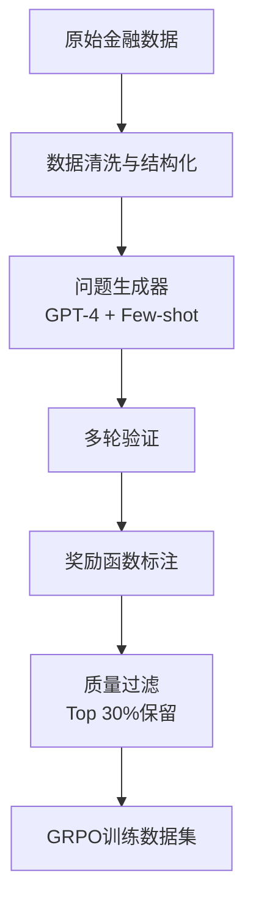

# GRPO 训练经验：金融场景行业信息助手优化方案

> 基于 Kimi K1.5 与 DeepSeek-R1 技术报告的实践总结

## 一、背景与目标

### 1.1 项目现状分析

当前行业信息助手具备以下核心能力：
- **知识库问答**：基于向量检索的行业知识问答
- **深度研究**：多轮搜索、分析、生成研报
- **实时信息**：新闻、招标、政策信息聚合
- **数据对话**：自然语言查询数据库

### 1.2 训练目标

通过 **GRPO (Group Relative Policy Optimization)** 强化学习，实现：
1. 提升金融领域推理的准确性和深度
2. 增强多轮工具调用（搜索/数据库/计算）的协调能力
3. 优化长文本研报生成的逻辑性和专业性
4. 减少幻觉，提高金融数据引用准确性

---

## 二、GRPO 核心原理

### 2.1 为什么选 GRPO？

| 方法 | 问题 | GRPO 优势 |
|------|------|----------|
| SFT (监督微调) | 受限于人工标注质量，难以覆盖复杂推理 | 通过奖励信号自动探索更优推理路径 |
| PPO (传统 RL) | 需要训练 Value Network，显存开销大 | 无需 Value Model，组内相对奖励简化计算 |
| DPO (直接偏好) | 依赖成对偏好数据，构造成本高 | 通过规则/模型自动打分，数据获取成本低 |

### 2.2 GRPO 核心公式

```
GRPO 奖励计算：
- 对同一问题采样 G 个回答（Group）
- 计算组内奖励的均值 μ 和标准差 σ
- 对每个回答， Advantage = (reward - μ) / σ

目标函数：
L_GRPO = E[ min(π_new/π_old * A, clip(π_new/π_old, 1-ε, 1+ε) * A) ] - β * KL(π_new || π_ref)
```

**关键洞察**：组内相对奖励消除了对绝对奖励模型的依赖，天然适合金融场景（答案正确性可通过规则验证）。

---

## 三、数据构造策略

### 3.1 金融场景数据分类

#### 类型 A：可验证计算题（Reward = 规则验证）

```json
{
  "question": "某公司2023年营收500亿元，同比增长25%，净利润率12%，计算其2022年营收和2023年净利润",
  "reasoning_trace": [
    "设2022年营收为X，则 X * 1.25 = 500亿",
    "X = 500 / 1.25 = 400亿元（2022年营收）",
    "2023年净利润 = 500亿 * 12% = 60亿元"
  ],
  "ground_truth": {
    "2022_revenue": "400亿元",
    "2023_profit": "60亿元"
  },
  "verifiable": true,
  "reward_function": "exact_match"
}
```

**数据来源**：
- 上市公司财报数据自动构造
- 券商研报中的财务计算抽取
- 金融考试题库（CFA/CPA/证券从业）

#### 类型 B：多跳检索题（Reward = 检索准确率 + 答案准确性）

```json
{
  "question": "对比宁德时代和比亚迪2024年上半年的研发投入占比，并分析其技术路线差异",
  "required_tools": [
    "search_company_financials(company='宁德时代', period='2024H1')",
    "search_company_financials(company='比亚迪', period='2024H1')",
    "search_company_tech_route(company='宁德时代')",
    "search_company_tech_route(company='比亚迪')"
  ],
  "reward_components": {
    "tool_call_correctness": 0.3,
    "data_retrieval_accuracy": 0.3,
    "comparison_completeness": 0.2,
    "analysis_depth": 0.2
  }
}
```

**数据构造方法**：
1. 从研报中提取对比分析问题
2. 用 GPT-4 生成黄金标准答案（带完整工具调用链）
3. 人工审核验证答案正确性

#### 类型 C：长文本研报生成（Reward = 多维度评估）

```json
{
  "task": "基于以下数据，生成新能源汽车行业2025年投资策略报告",
  "input_data": {
    "market_data": "...",
    "policy_docs": "...",
    "company_financials": "..."
  },
  "evaluation_criteria": {
    "structure_completeness": "是否包含摘要、市场分析、政策解读、投资建议",
    "data_accuracy": "引用的数据是否准确（可交叉验证）",
    "logic_consistency": "论证逻辑是否自洽",
    "professional_tone": "语言是否符合金融研报规范"
  }
}
```

**奖励模型设计**：
- 规则层：数据准确性检查（正则提取数字验证）
- 模型层：使用训练好的金融研报质量评估模型打分
- 对比层：与优质研报库计算语义相似度

### 3.2 数据构造流水线



**关键技巧**：
1. **难度分级**：Easy/Medium/Hard 按推理步数划分，训练时逐步增加难度
2. **多样性采样**：确保覆盖不同行业、不同问题类型
3. **负样本挖掘**：收集模型常见错误，针对性构造对比样本

---

## 四、训练方案设计

### 4.1 整体训练流程

```
Phase 1: 冷启动（SFT）
    ↓ 1000-5000 条高质量金融推理数据
Phase 2: 强化学习（GRPO）
    ↓ 使用可验证奖励信号
Phase 3: 拒绝采样微调（RFT）
    ↓ 用 RL 后的模型生成优质回答，再 SFT
Phase 4: 最终 RL 打磨
```

### 4.2 Phase 1: 冷启动数据构造

**目标**：让模型掌握基本的金融推理格式

```json
{
  "messages": [
    {"role": "system", "content": "你是一个专业的金融分析助手，需要展示完整的推理过程。"},
    {"role": "user", "content": "分析贵州茅台的盈利能力"},
    {"role": "assistant", "content": "<reasoning>\n1. 首先获取茅台最新的财务数据...\n2. 计算关键指标：ROE、毛利率、净利率...\n3. 对比行业平均水平...\n</reasoning>\n<answer>\n根据2024年财报...\n</answer>"}
  ]
}
```

**训练配置**：
- 学习率：1e-5
- Batch size：32
- Epochs：3
- LoRA r=64, alpha=128

### 4.3 Phase 2: GRPO 强化学习

**超参数设置**（参考 DeepSeek-R1）：

```python
grpo_config = {
    # 组大小：每个问题采样 G 个回答
    "group_size": 8,
    
    # KL 散度系数，控制与参考模型的偏离程度
    "kl_coef": 0.04,
    
    # 学习率
    "learning_rate": 1e-6,
    
    # 批次大小
    "batch_size": 64,
    
    # 最大序列长度（长文本研报需要）
    "max_length": 8192,
    
    # 温度系数，控制探索程度
    "temperature": 0.7,
    
    # 训练步数
    "num_steps": 1000
}
```

**奖励函数设计**：

```python
def compute_financial_reward(response, ground_truth):
    """
    金融场景复合奖励函数
    """
    rewards = {}
    
    # 1. 格式奖励（是否有清晰的推理过程）
    rewards["format"] = check_reasoning_format(response)
    
    # 2. 计算准确性（可验证问题）
    if is_verifiable(ground_truth):
        rewards["accuracy"] = verify_calculation(response, ground_truth)
    
    # 3. 工具调用正确性
    rewards["tool_usage"] = evaluate_tool_calls(response)
    
    # 4. 幻觉惩罚（检测虚构数据）
    rewards["hallucination"] = -detect_hallucination(response)
    
    # 5. 专业性评分（使用奖励模型）
    rewards["professionalism"] = reward_model.score(response)
    
    # 加权求和
    total_reward = (
        0.1 * rewards["format"] +
        0.4 * rewards["accuracy"] +
        0.2 * rewards["tool_usage"] +
        0.2 * rewards["hallucination"] +
        0.1 * rewards["professionalism"]
    )
    
    return total_reward
```

### 4.4 Phase 3: 拒绝采样微调 (RFT)

**目的**：固化 RL 学到的能力，提高推理效率

```python
# 用训练好的 RL 模型生成多个回答
responses = [rl_model.generate(question) for _ in range(K)]

# 只保留高奖励样本
high_quality_responses = [
    r for r in responses 
    if compute_reward(r) > threshold
]

# 用这些样本进行 SFT
sft_training_data = [
    {"messages": [{"role": "user", "content": q}, {"role": "assistant", "content": r}]}
    for q, r in zip(questions, high_quality_responses)
]
```

### 4.5 Phase 4: 最终 RL 打磨

- 使用更严格的质量阈值
- 引入对比学习（Contrastive Learning）
- 针对特定错误类型进行针对性训练

---

## 五、验证策略

### 5.1 自动验证指标

| 指标 | 计算方法 | 目标值 |
|------|---------|--------|
| 计算准确率 | 规则验证可计算问题 | > 95% |
| 工具调用成功率 | 解析工具调用格式是否正确 | > 90% |
| 数据引用准确率 | 抽查引用数据与源数据一致性 | > 98% |
| 幻觉率 | 人工审核检测虚构信息 | < 2% |
| 研报结构完整性 | 规则检查必须章节是否齐全 | > 95% |

### 5.2 人工评估维度

**金融专业评估**（由分析师团队完成）：
1. **逻辑严谨性**：推理链条是否完整，是否有跳跃
2. **分析深度**：是否触及问题本质，还是停留在表面
3. **专业表达**：术语使用是否准确，表达是否规范
4. **实用性**：结论是否有实际参考价值

**评估方式**：
- 盲测：对比基线模型与 GRPO 模型的回答
- A/B 测试：随机抽取 100 个金融问题，双盲评分
- 用户反馈：上线后收集真实用户满意度

### 5.3 持续监控机制

```python
# 生产环境监控
def production_monitoring():
    metrics = {
        # 响应时间分布
        "latency_p99": measure_latency(),
        
        # 用户满意度（点赞/点踩比例）
        "satisfaction_rate": get_user_feedback(),
        
        # 工具调用成功率
        "tool_success_rate": monitor_tool_calls(),
        
        # 错误类型分布
        "error_distribution": analyze_errors(),
        
        # 数据新鲜度（知识库更新延迟）
        "data_freshness": check_data_timeliness()
    }
    
    # 触发阈值时自动告警
    if metrics["satisfaction_rate"] < 0.85:
        send_alert("模型性能下降，需要重新训练")
```

---

## 六、实施路线图

### Week 1-2: 数据准备
- [ ] 整理现有金融数据集
- [ ] 构造 5000 条冷启动 SFT 数据
- [ ] 设计并实现奖励函数
- [ ] 搭建训练基础设施

### Week 3-4: 冷启动训练
- [ ] SFT 训练基座模型
- [ ] 评估基线性能
- [ ] 收集 bad cases，迭代数据质量

### Week 5-8: GRPO 训练
- [ ] 实现 GRPO 训练框架
- [ ] 小批量实验调参
- [ ] 全量数据训练
- [ ] 中间模型评估

### Week 9-10: RFT 与打磨
- [ ] 拒绝采样生成优质数据
- [ ] SFT 微调
- [ ] 最终 RL 优化

### Week 11-12: 验证与上线
- [ ] 全面评估
- [ ] A/B 测试
- [ ] 灰度上线
- [ ] 监控体系建设

---

## 七、风险与应对

### 7.1 训练不稳定

**现象**：Loss 震荡，奖励不上升

**解决方案**：
1. 降低学习率（1e-6 → 5e-7）
2. 增大 KL 约束系数（0.04 → 0.1）
3. 使用 Reward Clipping（限制单步奖励范围）

### 7.2 奖励作弊

**现象**：模型找到漏洞获取高奖励（如重复正确但不相关内容）

**解决方案**：
1. 奖励函数增加多样性惩罚
2. 引入长度惩罚，鼓励简洁回答
3. 人工审核高奖励样本，修复漏洞

### 7.3 知识遗忘

**现象**：金融推理能力提升，但通用能力下降

**解决方案**：
1. 混合通用领域数据（10-20%）
2. 使用 LoRA 而非全参数微调
3. 定期进行通用能力评估

---

## 八、参考资源

1. **DeepSeek-R1**: "Incentivizing Reasoning Capability in LLMs via Reinforcement Learning" (2025)
2. **Kimi K1.5**: "Scaling Reinforcement Learning with LLMs" (2025)
3. **GRPO 原始论文**: "DeepSeekMath: Pushing the Limits of Mathematical Reasoning in Open Language Models"
4. **OpenRLHF**: 开源 RLHF 训练框架

---

## 九、附录：Prompt 示例

### 系统 Prompt（训练用）

```
你是一个专业的金融分析助手。在回答问题时，请遵循以下原则：

1. **推理过程展示**：使用 <reasoning> 标签展示你的思考过程，包括：
   - 问题分解
   - 数据获取计划
   - 关键计算步骤
   - 逻辑验证

2. **工具使用**：当需要外部数据时，使用以下格式调用工具：
   <tool_call>
   {"name": "tool_name", "arguments": {...}}
   </tool_call>

3. **数据引用**：所有引用的数据必须标注来源，格式为 [来源: 报告名/日期]

4. **最终回答**：使用 <answer> 标签输出最终结论

5. **不确定性声明**：如果数据不完整或存在不确定性，明确说明

示例：
<reasoning>
1. 用户询问某公司的盈利能力，我需要获取其最新财报数据
2. 调用工具：search_financial_report(company="XXX")
3. 计算 ROE = 净利润 / 净资产 = ...
4. 对比行业平均水平...
</reasoning>
<tool_call>
{"name": "search_financial_report", "arguments": {"company": "XXX", "year": 2024}}
</tool_call>
<answer>
根据2024年财报[来源: XXX 2024年报]，该公司ROE为15%，高于行业平均水平12%...
</answer>
```

---

*文档版本: v1.0*  
*更新时间: 2026-03-04*  
*作者: AI Research Team*
