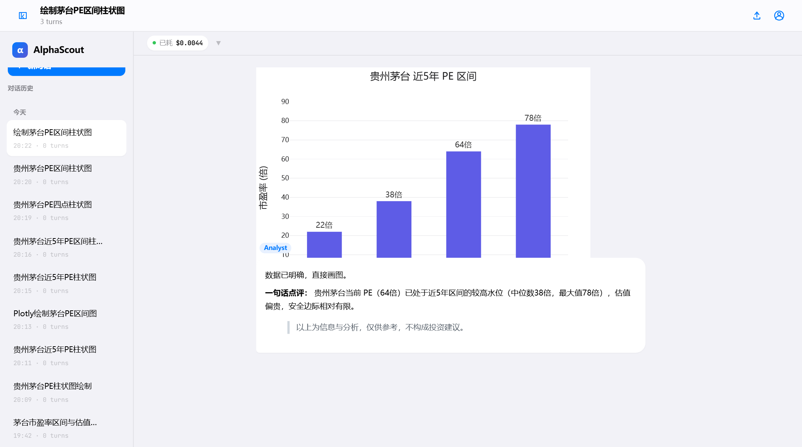
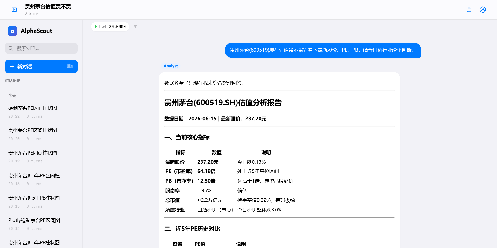
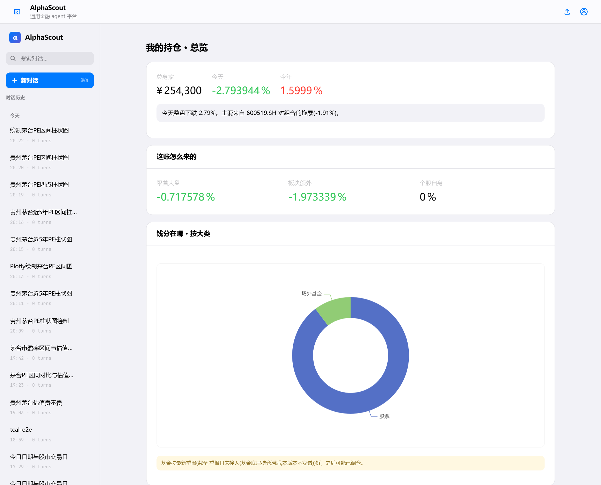
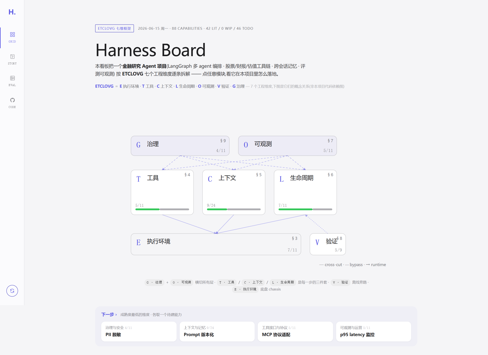
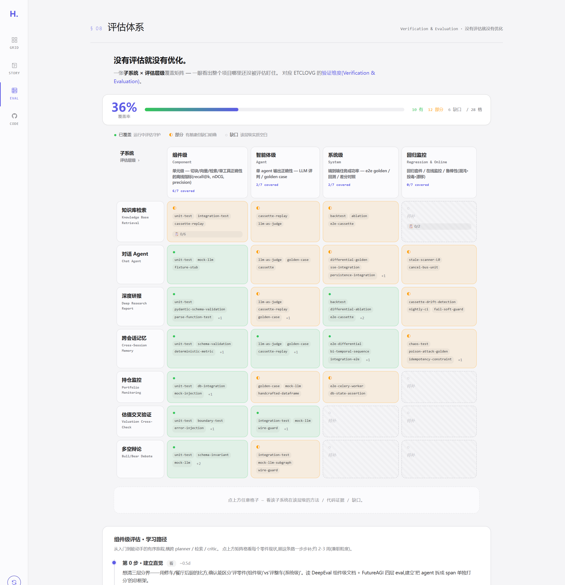

# AlphaScout: 面向 A 股研究的 AI 研投助手

AlphaScout 是面向 A 股研究的 AI 研投助手。用户提出股票研究问题后，系统会拆解任务、调用行情和财务数据、计算指标、生成图表，并给出可追溯的判断。

仓库包含对话研投、深度尽调、持仓监控、跨会话记忆、知识库问答和研发看板。默认走 mock 模式，不产生 API 费用；填入 Tushare、LLM 和搜索 key 后可接真实数据。

> 免责声明：本项目仅供学习和研究，不构成任何投资建议。

## 为什么做这个项目

金融研究很少只是查一个数。一个完整判断通常要同时看行情、三表、估值、行业对比、资金流和公告。人工慢，普通聊天机器人又容易把旧数据、猜测和事实混在一起。

AlphaScout 把研究流程做成可观察、可复核的 AI 系统：

- 用户自然语言提问，不用记接口和字段名。
- Agent 自己规划步骤，取数、计算和写作都有边界。
- 财务和行情数据必须来自工具调用，估值等数字由确定性代码计算。
- 最终回答带依据，避免只有结论、没有出处。

为此，工具调用、事实来源、上下文记忆和评估回放都做成显式流程。

## 功能

| 场景 | 用户看到的结果 | 系统动作 |
|---|---|---|
| 对话研投 | 问一句股票研究问题，得到数据、图表和结论 | 工具规划、真实数据调用、Python 计算、流式输出 |
| 深度尽调 | 生成一份带来源和审查反馈的标的研究报告 | 多角色协作、质量审核、失败后重做 |
| 持仓监控 | 盘中扫描组合风险，红色告警触发深入调查 | 规则信号、异步任务、预算和去重控制 |
| 跨会话记忆 | 系统记住用户偏好、风险承受能力和历史讨论 | 分层记忆、图谱与向量混合召回 |
| 知识库问答 | 研报、财报、政策入库后可在对话中引用 | 按文档类型切块、向量检索、来源回填 |
| Harness Board | 用看板拆解项目实现结构 | 工程维度、评估结果、研发记录 |

## 界面预览

**对话研投：一句话提问，系统自己取数、计算、画图并给出判断**



**结构化分析：数字来自工具调用，可以回到来源复核**



**持仓总览：把组合涨跌拆成可解释的来源**



**Harness Board：按工程维度拆解项目实现**

| 工程维度全景图 | 评估体系看板 |
|---|---|
|  |  |

## 架构总览

```text
React 前端
  对话页 / 研报页 / 持仓页 / 监控页 / 记忆页 / 知识库页
        |
FastAPI 后端
        |
        +-- chatloop: 对话研究循环，工具调用，终止条件，上下文分区
        +-- agents: 深度尽调，估值交叉验证，多空辩论
        +-- services: LLM、Tushare、搜索、知识库、记忆、监控、评估
        +-- router: 对外 API
        |
PostgreSQL / Redis / Milvus
  会话与业务数据 / 异步任务与缓存 / 向量检索
```

| 层 | 主要选型 |
|---|---|
| 后端 | Python 3.11, FastAPI, httpx, Celery |
| 前端 | React 19, Vite, TypeScript, Ant Design |
| 数据 | PostgreSQL, Redis, Milvus |
| LLM 接入 | OpenAI 兼容协议，默认适配阿里百炼 / DeepSeek 等兼容端点 |
| 金融数据 | Tushare Pro real/mock 双实现 |
| 质量 | pytest, pytest-recording, mypy, ruff, uv |

## 快速开始

下面命令默认在项目根目录执行。默认使用 mock 模式，不产生 API 费用。

### 环境要求

- Python 3.11+
- Node.js 20+
- [uv](https://docs.astral.sh/uv/) 包管理器
- Docker Desktop 可选。只有启动 PostgreSQL、Redis、Milvus 等组件时才需要。

### 安装

```bash
# 后端依赖，包含开发工具和知识库相关依赖
uv sync --extra dev --extra kb

# 配置环境变量
cp backend/.env.example backend/.env

# 前端依赖
cd frontend && npm install && cd ..
```

如果不需要知识库检索，可以用更轻的安装方式：

```bash
uv sync --extra dev
```

### 启动

```bash
# 终端 1：后端，默认端口 8000
uv run poe serve

# 终端 2：前端，默认端口 5173
cd frontend && npm run dev
```

打开 <http://localhost:5173>，可以先试这个问题：

> 贵州茅台现在估值贵不贵？看下最新股价、PE、PB，结合白酒行业给个判断。

### 接入真实数据

默认 `*_MODE=mock`。需要真实数据时，修改 `backend/.env`：

| 配置 | 作用 |
|---|---|
| `DASHSCOPE_API_KEY` | LLM key，对话和研报需要 |
| `TUSHARE_MODE=real` + `TUSHARE_TOKEN` | 真实 A 股行情和财务数据 |
| `KB_MODE=real` | 知识库向量检索，需要 Milvus |
| `BOCHA_MODE=real` + `BOCHA_API_KEY` | 真实 Web 搜索 |
| `EMAIL_MODE=real` + SMTP 配置 | 持仓预警邮件通知 |

完整配置见 `backend/.env.example`。

### 按需启动进阶组件

```bash
docker compose up -d postgres redis     # 会话持久化、记忆、监控调度
./start-services.sh start                # Milvus / Redis，知识库和记忆检索
make worker && make beat                 # Celery worker 和定时任务
make board                               # Harness Board，默认端口 8910
```

## 项目结构

```text
.
├── backend/
│   ├── app/
│   │   ├── chatloop/        # 对话研究循环
│   │   ├── agents/          # 深度尽调、估值交叉验证、多空辩论
│   │   ├── orchestration/   # LangGraph 子图和检查点
│   │   ├── services/        # LLM、Tushare、KB、记忆、监控、评估
│   │   ├── router/          # FastAPI 路由
│   │   └── app_main.py      # 应用入口
│   └── tests/               # 单元、集成、e2e、评估测试
├── frontend/                # React 前端
├── dashboard/               # Harness Board 研发看板
├── docs/                    # 设计文档、项目故事、截图
│   ├── superpowers/         # spec 和实施计划
│   └── claude-context/      # 长期工程上下文卡片
├── docker-compose.yml
└── Makefile
```

## 测试与质量

```bash
uv run poe test       # 单元、集成、cassette 回放
uv run poe lint       # ruff format check、ruff check、mypy
uv run poe eval       # golden case 评估
make board-test       # Harness Board 测试
```

| 层级 | 是否需要真实 LLM | 主要用途 |
|---|---|---|
| 单元测试 | 否 | 验证纯函数、规则、边界条件 |
| 集成测试 | 否，默认 mock | 验证服务之间的协作 |
| cassette 回放 | 否 | 回放已录制的外部 API 调用 |
| 真模型评估 | 是，会产生费用 | 检查真实 Agent 行为和回答质量 |

## 许可证

MIT License

## 免责声明

本系统提供的所有数据与分析仅供学习研究参考，不构成任何投资建议。本项目为个人技术作品，非持牌投资顾问。投资有风险，入市需谨慎。
