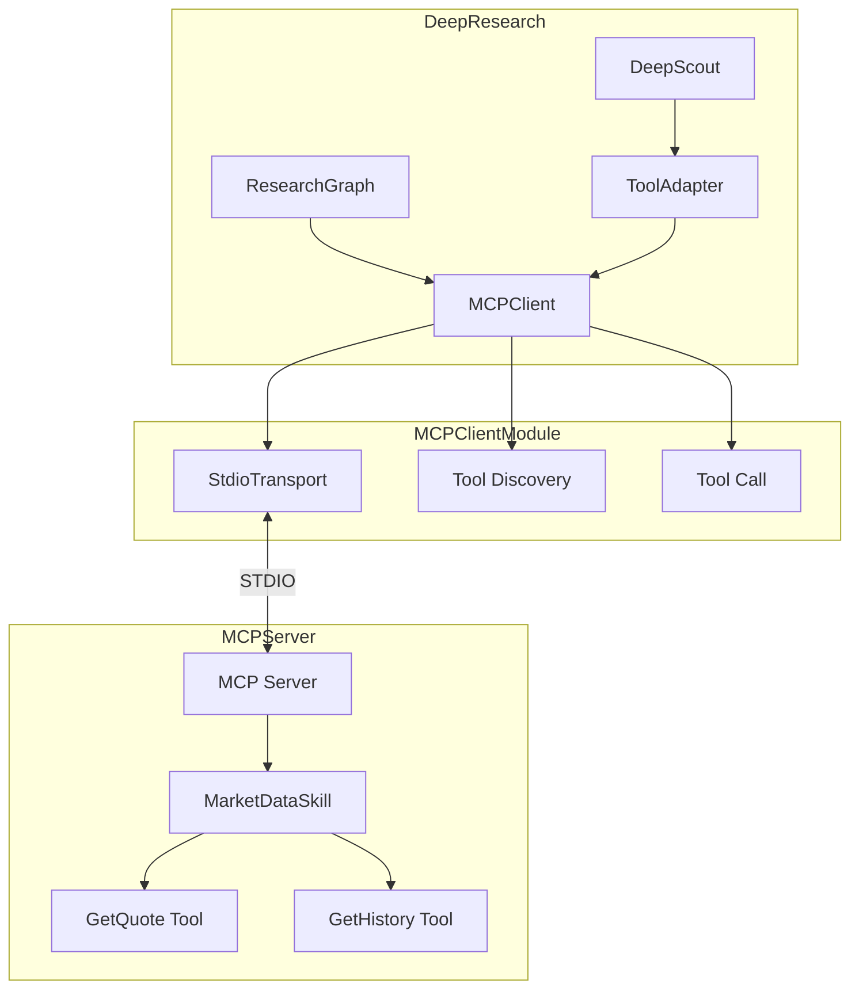

# MCP Client 架构文档

## 概述

MCP Client 是 DeepResearch V2.0 的 MCP (Model Context Protocol) 客户端实现，负责与 MCP Server 进行通信，提供标准化的工具调用接口。

## 整体架构



## 核心组件

### 1. MCPClient

`MCPClient` 是 MCP 协议的核心客户端实现，负责：

- **连接管理**：通过 STDIO 传输与 MCP Server 建立连接
- **工具发现**：获取 MCP Server 提供的工具列表
- **工具调用**：执行远程工具并获取结果
- **生命周期管理**：自动清理资源

```python
from backend.app.mcp_client.client import MCPClient

# 创建客户端
client = MCPClient(
    server_command=["python", "-m", "backend.app.mcp_server.server"],
    timeout=30.0
)

# 连接并发现工具
await client.connect()
tools = await client.discover_tools()

# 调用工具
result = await client.call_tool("get_quote", {"symbol": "AAPL"})

# 断开连接
await client.disconnect()
```

### 2. ToolAdapter

`ToolAdapter` 是工具调用适配器，为 DeepResearch 提供统一的工具调用接口：

- **向后兼容**：支持 StockService 和 MCP 两种方式
- **自动降级**：MCP 不可用时自动切换到 StockService
- **统一接口**：对外提供一致的调用方式

```python
from backend.app.mcp_client.adapter import ToolAdapter
from backend.app.service.stock_service import StockService

# 创建适配器
adapter = ToolAdapter(
    stock_service=stock_service,
    mcp_client=mcp_client,
    use_mcp=True  # 优先使用 MCP
)

# 获取股票报价
quote = await adapter.get_quote("AAPL")
```

## 目录结构

```
backend/app/mcp_client/
├── __init__.py          # 模块导出
├── client.py            # MCPClient 核心实现
├── adapter.py           # ToolAdapter 适配器
├── test_client.py       # 单元测试
├── test_adapter.py      # 适配器测试
└── test_integration.py  # 集成测试
```

## 集成流程

### 1. 初始化阶段

```python
# ResearchGraph 初始化时创建 MCPClient
self.mcp_client = MCPClient(
    server_command=["python", "-m", "backend.app.mcp_server.server"],
    timeout=30.0
)
```

### 2. 连接阶段

```python
# 在 graph 启动时连接 MCP
await self.mcp_client.connect()
```

### 3. 工具调用阶段

```python
# DeepScout 通过 ToolAdapter 调用工具
adapter = ToolAdapter(
    stock_service=self.stock_service,
    mcp_client=self.mcp_client,
    use_mcp=True
)
quote = await adapter.get_quote(symbol)
```

### 4. 清理阶段

```python
# 在 graph 结束时断开连接
await self.mcp_client.disconnect()
```

## 配置说明

### MCPClient 配置

| 参数 | 类型 | 默认值 | 说明 |
|------|------|--------|------|
| `server_command` | List[str] | 必需 | 启动 MCP Server 的命令 |
| `timeout` | float | 30.0 | 连接超时时间（秒） |

### ToolAdapter 配置

| 参数 | 类型 | 默认值 | 说明 |
|------|------|--------|------|
| `stock_service` | StockService | 必需 | 股票服务实例 |
| `mcp_client` | MCPClient | None | MCP 客户端实例 |
| `use_mcp` | bool | True | 是否优先使用 MCP |

## 错误处理

### MCPClient 错误类型

- `ConnectionError`: 连接失败
- `TimeoutError`: 连接/调用超时
- `ToolError`: 工具调用失败
- `DiscoveryError`: 工具发现失败

### 降级策略

当 MCP 调用失败时，ToolAdapter 会自动降级到 StockService：

```python
try:
    if self.use_mcp and self.mcp_client and self.mcp_client.connected:
        return await self._call_mcp_tool("get_quote", {"symbol": symbol})
except Exception as e:
    logger.warning(f"MCP call failed, falling back to StockService: {e}")

# 降级到 StockService
return await self._call_stock_service("get_quote", symbol=symbol)
```

## 性能优化

1. **连接复用**: MCPClient 连接后保持长连接，避免重复建立
2. **超时控制**: 可配置超时时间，防止长时间阻塞
3. **并发支持**: 支持并发工具调用

## 测试

运行所有测试：

```bash
cd /Users/talantan/.openclaw/workspace-dev/external/financial-research-assistant
python -m pytest backend/app/mcp_client/test_*.py -v
```

## 相关文档

- [API 文档](API.md) - 详细接口说明
- [MCP 集成记录](../../docs/MCP_INTEGRATION.md) - 改造方案
