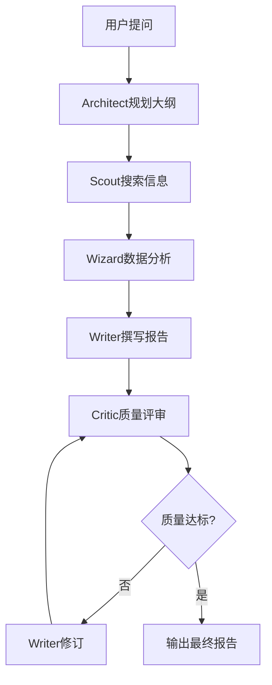

# Deep Research Skill

## 📋 概述

**Deep Research Skill** 是基于多智能体协作的深度研究服务，能够自动完成复杂研究任务，生成高质量研究报告。

### 核心特性

- 🤖 **5个专家Agent协作**
  - **Chief Architect（架构师）**: 规划研究大纲和结构
  - **Deep Scout（侦探）**: 搜索和收集信息
  - **Code Wizard（极客）**: 数据分析和可视化
  - **Critic Master（评论家）**: 质量评审和反馈
  - **Lead Writer（笔杆）**: 报告撰写和修订

- 🔄 **动态状态机工作流**
  ```
  Plan → Research → Analyze → Write → Review → Revise
  ```

- 🎯 **对抗式质检**: 毒舌评论家确保报告质量
- 📊 **代码解释器**: 支持Python数据分析和可视化
- 🌊 **流式输出**: 支持SSE实时反馈

---

## 🛠️ 工具列表

### 1. research_stream

**描述**: 执行深度研究任务，返回流式事件

**使用场景**: 需要实时反馈的研究任务，如前端展示研究进度

**参数**:
- `query` (string, required): 研究问题或主题
  - 示例: "中国AI芯片市场分析"
  - 示例: "茅台近期投资价值分析"
- `session_id` (string, optional): 会话ID
- `search_web` (boolean, optional): 是否启用网络搜索（默认true）
- `search_local` (boolean, optional): 是否启用本地知识库搜索（默认false）
- `resume` (boolean, optional): 是否从检查点恢复（默认false）

**返回**:
```json
{
  "success": true,
  "session_id": "uuid",
  "query": "中国AI芯片市场分析",
  "final_report": "完整的研究报告...",
  "quality_score": 0.92,
  "phase": "completed",
  "total_events": 156,
  "events": [...]
}
```

---

### 2. research_sync

**描述**: 执行深度研究任务，返回完整结果（非流式）

**使用场景**: 批处理场景，一次性获取完整研究结果

**参数**:
- `query` (string, required): 研究问题或主题
- `session_id` (string, optional): 会话ID
- `search_web` (boolean, optional): 是否启用网络搜索（默认true）
- `search_local` (boolean, optional): 是否启用本地知识库搜索（默认false）

**返回**:
```json
{
  "success": true,
  "session_id": "uuid",
  "query": "茅台近期投资价值分析",
  "final_report": "# 茅台投资价值分析报告\n\n## 核心观点\n...",
  "quality_score": 0.95,
  "outline": [
    {"title": "市场表现", "level": 1},
    {"title": "财务分析", "level": 1}
  ],
  "facts": [
    {"content": "茅台2024年营收1234亿", "source": "年报", "confidence": 0.98}
  ],
  "data_points": [
    {"metric": "PE", "value": 35.2, "date": "2024-03-01"}
  ],
  "charts": [
    {"type": "line", "data": {...}, "title": "股价走势"}
  ],
  "references": ["https://...", "https://..."],
  "insights": ["茅台估值处于历史中位数..."],
  "iterations": 8,
  "phase": "completed"
}
```

---

### 3. quick_research

**描述**: 执行快速研究，返回核心发现和简要报告

**使用场景**: 快速了解某个主题，不需要完整深度研究

**参数**:
- `query` (string, required): 研究问题
- `max_iterations` (integer, optional): 最大迭代次数（默认3次）

**返回**:
```json
{
  "success": true,
  "query": "平安银行财务状况",
  "summary": "平安银行2024年财务状况良好，营收增长12%...",
  "key_facts": [
    {"content": "营收1234亿", "confidence": 0.95},
    {"content": "净利润456亿", "confidence": 0.92}
  ],
  "key_insights": [
    "零售业务占比提升至60%",
    "不良贷款率下降至1.2%"
  ],
  "quality_score": 0.88,
  "iterations": 3
}
```

---

## 📖 使用示例

### 示例1: 股票投资研究

```python
# 通过 MCP Client 调用
result = await mcp_client.call_tool(
    "deep_research.research_sync",
    {
        "query": "茅台近期投资价值分析，包括财务指标、估值水平、行业地位",
        "search_web": True
    }
)

print(result["final_report"])
print(f"质量评分: {result['quality_score']}")
```

### 示例2: 行业研究

```python
# 快速了解某个行业
result = await mcp_client.call_tool(
    "deep_research.quick_research",
    {
        "query": "中国新能源汽车行业现状",
        "max_iterations": 3
    }
)

print(result["summary"])
for fact in result["key_facts"]:
    print(f"- {fact['content']}")
```

### 示例3: 流式研究（实时反馈）

```python
# 适用于前端展示进度
result = await mcp_client.call_tool(
    "deep_research.research_stream",
    {
        "query": "比亚迪vs特斯拉竞争分析",
        "search_web": True
    }
)

# 处理事件流
for event in result["events"]:
    if event["type"] == "phase":
        print(f"阶段: {event['content']}")
    elif event["type"] == "agent":
        print(f"Agent {event['agent']}: {event['content']}")
```

---

## 🎯 工作流程



**各阶段说明**:

1. **Plan（规划）**: Chief Architect 分析问题，规划研究大纲
2. **Research（研究）**: Deep Scout 搜索网络和知识库，收集信息
3. **Analyze（分析）**: Code Wizard 执行数据分析和可视化
4. **Write（撰写）**: Lead Writer 基于收集的信息撰写报告
5. **Review（评审）**: Critic Master 进行质量评审，提出改进建议
6. **Revise（修订）**: Lead Writer 根据反馈修订报告
7. **循环**: 直到质量评分达标或达到最大迭代次数

---

## ⚙️ 配置说明

Deep Research Skill 会自动从配置文件读取以下配置：

```python
# config/llm_config.py
class ResearchConfig:
    max_iterations: int = 10  # 最大迭代次数
    quality_threshold: float = 0.85  # 质量阈值
    search_api_key: str = "..."  # 搜索API密钥
```

---

## 🔧 技术架构

**基础框架**: LangGraph
**多智能体**: 5个专家Agent
**状态管理**: TypedDict + Pydantic
**流式输出**: Server-Sent Events (SSE)
**检查点**: 支持中断恢复

---

## 📊 性能指标

- **平均响应时间**: 30-60秒（取决于问题复杂度）
- **质量评分**: 通常在0.85-0.95之间
- **迭代次数**: 平均5-8次
- **数据来源**: 网络搜索 + 本地知识库（可选）

---

## ⚠️ 注意事项

1. **API密钥**: 需要配置 LLM API 和搜索 API 密钥
2. **耗时**: 深度研究通常需要30-60秒，建议使用异步调用
3. **成本**: 每次研究会调用多次LLM，请注意API成本
4. **质量**: 质量评分<0.85时会自动触发修订
5. **检查点**: 支持中断恢复，但需要提供相同的session_id

---

## 📝 更新日志

### v2.0 (2024-03-08)
- ✅ 封装为 MCP Skill
- ✅ 支持3种调用模式（stream/sync/quick）
- ✅ 完整的参数校验和错误处理
- ✅ 标准化的返回格式

### v1.0
- 初始版本，基于 LangGraph 实现
- 5个Agent协作
- 对抗式质检
