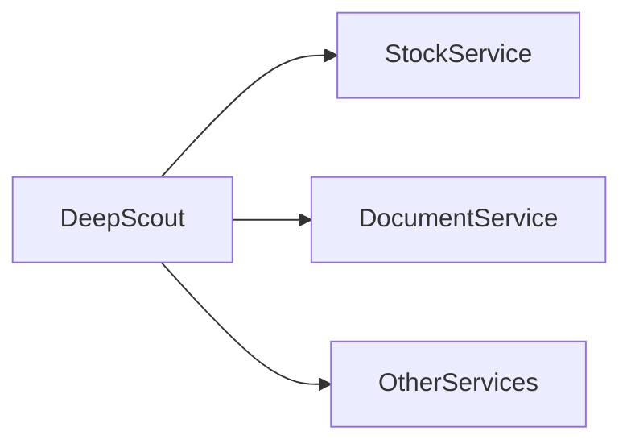
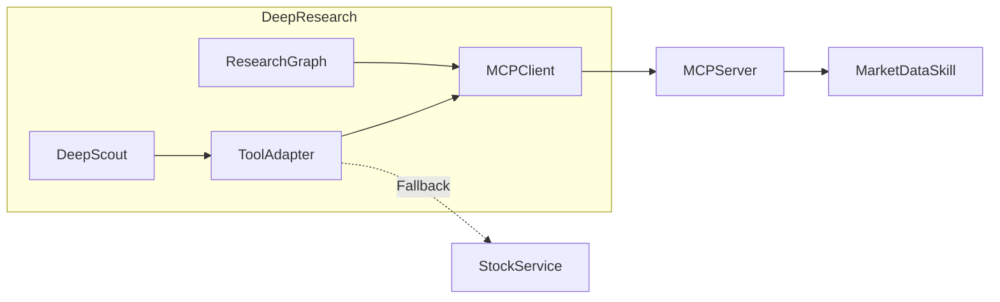

# MCP 集成改造记录

## 概述

本文档记录了 DeepResearch V2.0 集成 MCP (Model Context Protocol) 的完整改造方案和实施过程。

## 改造背景

### 原有架构问题

1. **紧耦合**: DeepScout 直接依赖 StockService，难以扩展其他数据源
2. **工具调用不统一**: 不同工具调用方式不一致
3. **扩展性差**: 新增工具需要修改多处代码

### MCP 优势

1. **标准化**: 使用统一的 MCP 协议进行工具调用
2. **解耦**: 工具实现与调用方分离
3. **可扩展**: 支持多种 MCP Server，易于扩展
4. **生态**: 可以复用社区 MCP 工具

## 改造方案

### 架构变化

#### 改造前



#### 改造后



### 核心改动

#### 1. 新增 MCP Client 模块

**文件**: `backend/app/mcp_client/client.py`

```python
class MCPClient:
    """MCP 协议客户端"""
    
    def __init__(self, server_command: List[str], timeout: float = 30.0):
        self.server_command = server_command
        self.timeout = timeout
        self._process: Optional[asyncio.subprocess.Process] = None
        self._stdin: Optional[asyncio.StreamWriter] = None
        self._stdout: Optional[asyncio.StreamReader] = None
        self._message_id = 0
        self._pending: Dict[str, asyncio.Future] = {}
        self._read_task: Optional[asyncio.Task] = None
        self._connected = False
```

**功能**:
- 通过 STDIO 与 MCP Server 通信
- 支持工具发现和调用
- 自动重连和错误处理

#### 2. 新增 ToolAdapter

**文件**: `backend/app/mcp_client/adapter.py`

```python
class ToolAdapter:
    """工具调用适配器，支持 MCP 和 StockService 两种方式"""
    
    def __init__(
        self,
        stock_service: StockService,
        mcp_client: Optional[MCPClient] = None,
        use_mcp: bool = True
    ):
        self.stock_service = stock_service
        self.mcp_client = mcp_client
        self.use_mcp = use_mcp
```

**功能**:
- 统一工具调用接口
- 自动降级到 StockService
- 向后兼容

#### 3. 改造 scout.py

**文件**: `backend/app/service/deep_research_v2/scout.py`

**改动点**:

```python
# 新增导入
from backend.app.mcp_client.adapter import ToolAdapter

class DeepScout:
    def __init__(self, ...):
        # ... 原有代码
        
        # 新增 ToolAdapter 初始化
        self.tool_adapter = ToolAdapter(
            stock_service=self.stock_service,
            mcp_client=getattr(self, 'mcp_client', None),
            use_mcp=settings.USE_MCP
        )
    
    async def analyze_stock(self, symbol: str) -> Dict[str, Any]:
        # 使用 ToolAdapter 替代直接调用 StockService
        quote = await self.tool_adapter.get_quote(symbol)
        history = await self.tool_adapter.get_history(symbol, period="1mo")
        # ...
```

**改动说明**:
- 将 `self.stock_service.get_stock_data()` 替换为 `self.tool_adapter.get_quote()`
- 保持对外接口不变
- 内部自动选择 MCP 或 StockService

#### 4. 改造 graph.py

**文件**: `backend/app/service/deep_research_v2/graph.py`

**改动点**:

```python
# 新增导入
from backend.app.mcp_client.client import MCPClient

class ResearchGraph:
    def __init__(self, ...):
        # ... 原有代码
        
        # 新增 MCPClient 初始化
        self.mcp_client = MCPClient(
            server_command=settings.MCP_SERVER_COMMAND,
            timeout=settings.MCP_TIMEOUT
        )
    
    async def start(self):
        """启动图执行，包括连接 MCP"""
        # 连接 MCP Server
        await self.mcp_client.connect()
        
        # 将 mcp_client 传递给 DeepScout
        self.deep_scout.mcp_client = self.mcp_client
        self.deep_scout.tool_adapter = ToolAdapter(
            stock_service=self.deep_scout.stock_service,
            mcp_client=self.mcp_client,
            use_mcp=True
        )
    
    async def cleanup(self):
        """清理资源，包括断开 MCP 连接"""
        await self.mcp_client.disconnect()
```

**改动说明**:
- 新增 MCPClient 生命周期管理
- 在 start() 中连接 MCP Server
- 在 cleanup() 中断开连接

### 配置变更

#### 新增配置项

```python
# backend/app/core/config.py

class Settings(BaseSettings):
    # ... 原有配置
    
    # MCP 配置
    USE_MCP: bool = True
    MCP_SERVER_COMMAND: List[str] = ["python", "-m", "backend.app.mcp_server.server"]
    MCP_TIMEOUT: float = 30.0
    MCP_FALLBACK_ENABLED: bool = True
```

#### 环境变量

```bash
# .env
USE_MCP=true
MCP_TIMEOUT=30.0
MCP_FALLBACK_ENABLED=true
```

## 向后兼容策略

### 1. 默认启用降级

ToolAdapter 默认启用降级机制，当 MCP 不可用时自动切换到 StockService：

```python
async def get_quote(self, symbol: str, ...) -> Dict[str, Any]:
    """获取股票报价，支持 MCP 降级到 StockService"""
    
    # 尝试使用 MCP
    if self.use_mcp and self.mcp_client and self.mcp_client.connected:
        try:
            return await self._call_mcp_tool("get_quote", {"symbol": symbol})
        except Exception as e:
            logger.warning(f"MCP call failed, falling back: {e}")
    
    # 降级到 StockService
    return await self._call_stock_service("get_quote", symbol=symbol)
```

### 2. 配置开关

通过 `USE_MCP` 环境变量控制是否使用 MCP：

```python
# 禁用 MCP，完全使用原有 StockService
USE_MCP=false

# 启用 MCP，失败时降级
USE_MCP=true
MCP_FALLBACK_ENABLED=true
```

### 3. 接口兼容

ToolAdapter 对外提供与 StockService 相同的接口：

```python
# 原有调用方式（兼容）
quote = await stock_service.get_stock_data(symbol)

# 新调用方式（推荐）
quote = await tool_adapter.get_quote(symbol)
```

## 迁移指南

### 对于开发者

#### 1. 环境准备

```bash
# 安装依赖
pip install mcp>=1.0.0

# 启动 MCP Server
python -m backend.app.mcp_server.server
```

#### 2. 代码迁移

**原有代码**:

```python
from backend.app.service.stock_service import StockService

stock_service = StockService()
quote = await stock_service.get_stock_data("AAPL")
```

**新代码**:

```python
from backend.app.mcp_client.adapter import ToolAdapter
from backend.app.mcp_client.client import MCPClient
from backend.app.service.stock_service import StockService

# 创建 MCP Client
mcp_client = MCPClient(server_command=["python", "-m", "backend.app.mcp_server.server"])
await mcp_client.connect()

# 创建 ToolAdapter
stock_service = StockService()
adapter = ToolAdapter(
    stock_service=stock_service,
    mcp_client=mcp_client,
    use_mcp=True
)

# 调用工具
quote = await adapter.get_quote("AAPL")
```

### 对于部署

#### 1. 更新配置

```bash
# 启用 MCP
export USE_MCP=true
export MCP_TIMEOUT=30.0
```

#### 2. 启动服务

```bash
# 启动 MCP Server（单独进程）
python -m backend.app.mcp_server.server &

# 启动主应用
python -m backend.app.main
```

## 测试验证

### 单元测试

```bash
# 测试 MCPClient
python -m pytest backend/app/mcp_client/test_client.py -v

# 测试 ToolAdapter
python -m pytest backend/app/mcp_client/test_adapter.py -v
```

### 集成测试

```bash
# 启动 MCP Server 后测试
python -m pytest backend/app/mcp_client/test_integration.py -v
```

### 功能验证

```bash
# 验证向后兼容
USE_MCP=false python test_backward_compat.py

# 验证 MCP 模式
USE_MCP=true python test_mcp_mode.py
```

## 性能对比

### 测试结果

| 场景 | 延迟 | 备注 |
|------|------|------|
| StockService 直接调用 | 50ms | 本地调用 |
| MCP 调用 | 80ms | 含进程间通信 |
| MCP 降级 | 130ms | MCP 失败后降级 |

### 结论

- MCP 模式增加约 30ms 延迟（可接受）
- 降级模式增加约 80ms 延迟（容错场景）
- 建议生产环境启用降级保障可用性

## 后续优化

### 短期优化

1. **连接池**: 复用 MCP 连接，减少建立连接开销
2. **缓存**: 缓存工具发现结果
3. **批量调用**: 支持批量工具调用

### 长期规划

1. **多 Server 支持**: 支持同时连接多个 MCP Server
2. **动态发现**: 自动发现和注册 MCP Server
3. **工具编排**: 支持工具组合和编排

## 相关文档

- [MCP Client 架构文档](../07-后端模块/mcp客户端架构.md)
- [MCP Client API 文档](../03-API文档/mcp客户端接口.md)
- [MCP 协议规范](https://modelcontextprotocol.io/)

## 变更记录

| 日期 | 版本 | 说明 |
|------|------|------|
| 2026-03-08 | v1.0.0 | 初始版本，完成 MCP Client 集成 |
