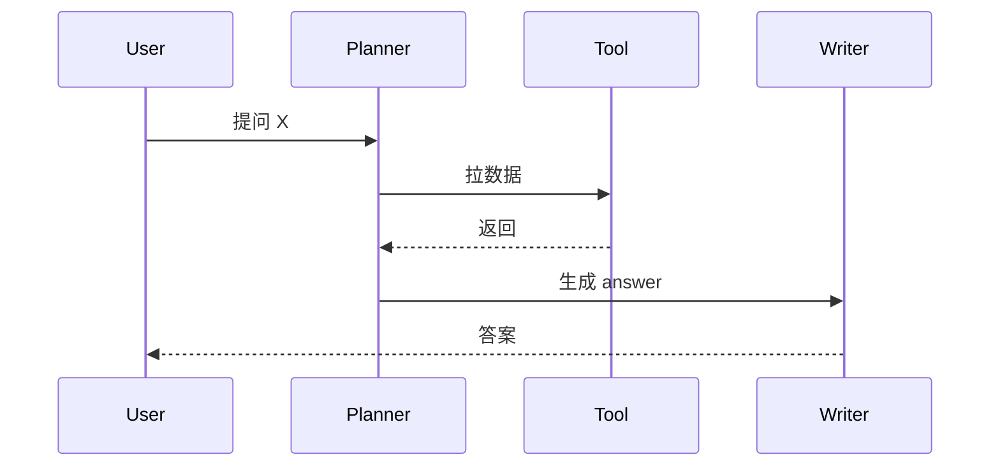

# Harness Board 框架重做 — Plan 4:/story 改造为 textarea + render(skill 接口占位)

> **For agentic workers:** REQUIRED SUB-SKILL: Use superpowers:subagent-driven-development (recommended) or superpowers:executing-plans to implement this plan task-by-task. Steps use checkbox (`- [ ]`) syntax for tracking.

**Goal:** 收尾框架重做 — 把 `/story` 从「自动派生三段式时间线」改造为「**textarea 粘 skill 输出 + 客户端 marked.js + mermaid.js 渲染**」(spec § 2.5)。base.html 的 marked + mermaid CDN 在 Plan 2 已引,Plan 4 只搭前端接口。同时退役 `story_builder.py` derive + `_story_card.html` partial(三段式派生不再需要)。Plan 4 ship 后 spec 4 plan 全部 ship,框架重做完成 — `/` + `/m/{dim}` + `/story` 三页 + DeepCard 6 字段 + 三色 + 上传齐全,后续轮可开始填内容。

**Architecture:** 简单 — `/story` handler 不再调用 `story_builder`(直接返回静态模板),`story.html` 重写为 textarea(用户粘 markdown)+ `<div id="story-out">` 渲染区(客户端 marked + mermaid 实时渲染);删 `_story_card.html` + `story_builder.py` + 对应测试。

**Tech Stack:** Starlette · Jinja2 · marked.js + mermaid.js(CDN,Plan 2 已引)· Python 3.11。

---

## File Structure

```
重写:
  dashboard/templates/story.html              (textarea + render area + 说明文)
  dashboard/server.py                         (story_view handler 简化:去 story_builder 调用)
  dashboard/static/style.css                  (加 .story-* 排版 CSS)

新增:
  dashboard/static/story.js                   (textarea oninput → renderField 实时渲染)
  dashboard/tests/integration/test_story_page.py

删除:
  dashboard/templates/_story_card.html
  dashboard/derive/story_builder.py
  dashboard/tests/unit/test_story_builder.py
  dashboard/tests/integration/test_story_endpoint.py(改造为 test_story_page,见上)
```

---

## Task 0:准备 + grep

- [ ] **Step 0.1:Verify baseline**

```bash
git status --short
uv run pytest dashboard/tests/ -q 2>&1 | tail -3
```
Expected: clean / 194 passed / 3 skip。

- [ ] **Step 0.2:grep — story_builder / _story_card 引用面**

```bash
grep -rnE "story_builder|build_story_cards|_story_card" dashboard/ backend/ --include="*.py" --include="*.html" --include="*.js" | grep -v __pycache__
```
Expected: 应只在 story.html + server.py(story_view 中) + story_builder.py + test 中。

---

## Task 1:重写 story.html + server.py story_view + style.css

**Files:**
- Rewrite: `dashboard/templates/story.html`
- Modify: `dashboard/server.py`
- Modify: `dashboard/static/style.css`

- [ ] **Step 1.1:Rewrite `story.html`**

替换整文件:

```html
{# Plan 4 Task 1 — /story 改造:textarea + render area (marked + mermaid client-side) #}




<section class="story-block">
  <div class="stage">
    <header class="story-head">
      <h1>故事</h1>
      <p class="story-sub">
        从故事生成 skill 拿到 markdown,粘到下方。支持 mermaid sequenceDiagram(用户视角时序图)。
      </p>
    </header>

    <div class="story-editor">
      <label class="story-label" for="story-input">skill 输出 markdown</label>
      <textarea id="story-input"
                class="story-input"
                placeholder="把 skill 输出的 markdown 粘到这里 …

支持 mermaid 代码块,例如:


"
                spellcheck="false"
                aria-label="markdown 输入"></textarea>
    </div>

    <div class="story-output">
      <header class="story-output-head">
        <span class="story-output-label">渲染结果</span>
        <span class="story-output-hint">实时 render — marked + mermaid</span>
      </header>
      <div id="story-out" class="story-render markdown-body" aria-live="polite">
        <p class="story-placeholder">粘 markdown 后,渲染结果会显示在这里。</p>
      </div>
    </div>

    <aside class="story-help">
      <h4>skill 调用提示</h4>
      <ul>
        <li>本看板不直接调 skill — 在 Claude Code 或 CLI 内调你的故事 skill,把 markdown 输出粘回来即可</li>
        <li>支持任何 marked.js 兼容的 markdown(标题、列表、code block、表格、引用、图片)</li>
        <li>mermaid:用 <code>```mermaid</code> 代码块,前端 mermaid.js 自动渲染流程图 / 时序图</li>
        <li>面试讲 capability 时:用户视角 → sequenceDiagram 是天然载体(scenario → planner → tool → critic → writer)</li>
      </ul>
    </aside>
  </div>
</section>

<script src="/static/story.js?v={{ asset_v }}" defer></script>

```

- [ ] **Step 1.2:简化 server.py `story_view`**

定位 `async def story_view`,改为:

```python
async def story_view(request: Request) -> HTMLResponse:
    """故事页 — Plan 4 改造:textarea + 客户端 marked + mermaid render。

    不再调用 story_builder(已退役)。skill 接入留后续:
    在 textarea 旁加按钮触发 POST /story/generate → 返回 markdown 填 textarea。
    """
    ctx = {"request": request, "asset_v": ASSET_V}
    return cast(HTMLResponse, templates.TemplateResponse("story.html", ctx))
```

清相关 import:
```bash
grep -nE "from dashboard\.derive\.story_builder|import.*story_builder|build_story_cards" dashboard/server.py
```
所有 hit 行删除。

- [ ] **Step 1.3:加 .story-* CSS(style.css 末尾追加)**

```css
/* ============================================================
 * Plan 4 Task 1 — /story page (textarea + render)
 * ============================================================ */
.story-block { padding: 36px 0 60px; }

.story-head { margin-bottom: 28px; }
.story-head h1 {
  font-family: 'Newsreader', 'Noto Serif SC', serif;
  font-size: 36px; font-weight: 500;
  margin: 0 0 8px;
  color: #1C1C1E;
}
.story-sub { color: #86868B; font-size: 14px; max-width: 640px; line-height: 1.7; }

.story-editor { margin-bottom: 22px; }
.story-label {
  display: block; font-size: 11px;
  font-family: 'Geist Mono', monospace;
  text-transform: uppercase; letter-spacing: 0.10em;
  color: #86868B;
  margin-bottom: 6px;
}
.story-input {
  width: 100%; min-height: 200px;
  padding: 14px 18px;
  border: 1px solid rgba(60,60,67,0.18);
  border-radius: 10px;
  background: white;
  font: inherit; font-family: 'Geist Mono', 'SF Mono', monospace;
  font-size: 13px; line-height: 1.6;
  color: #1C1C1E;
  resize: vertical;
  transition: border-color 0.18s;
}
.story-input:focus {
  outline: none;
  border-color: #5E5CE6;
  box-shadow: 0 0 0 3px rgba(94,92,230,0.12);
}

.story-output { margin-bottom: 28px; }
.story-output-head {
  display: flex; justify-content: space-between; align-items: baseline;
  margin-bottom: 8px;
}
.story-output-label {
  font-family: 'Geist Mono', monospace; font-size: 11px;
  text-transform: uppercase; letter-spacing: 0.10em;
  color: #86868B;
}
.story-output-hint { font-size: 11px; color: #C7C7CC; font-family: 'Geist Mono', monospace; }
.story-render {
  min-height: 200px;
  padding: 18px 22px;
  background: rgba(245,245,247,0.6);
  border-radius: 12px;
  border: 1px solid rgba(60,60,67,0.06);
}
.story-placeholder { color: #C7C7CC; font-style: italic; font-size: 13px; }

.story-help {
  margin-top: 30px;
  padding: 18px 22px;
  border-left: 3px solid #5E5CE6;
  background: rgba(94,92,230,0.04);
  border-radius: 0 8px 8px 0;
}
.story-help h4 { margin: 0 0 8px; font-size: 13px; color: #5E5CE6; font-weight: 600; }
.story-help ul { padding-left: 20px; margin: 0; }
.story-help li { font-size: 12px; line-height: 1.7; color: #6E6E73; margin: 3px 0; }
.story-help code { font-family: 'Geist Mono', monospace; font-size: 11px; background: rgba(94,92,230,0.10); padding: 1px 6px; border-radius: 4px; color: #5E5CE6; }
```

- [ ] **Step 1.4:Commit Task 1**

```bash
git add dashboard/templates/story.html dashboard/server.py dashboard/static/style.css
git commit -m "feat(harness-board): rewrite /story = textarea + render area (skill interface placeholder) (Plan 4 step 1)"
```

---

## Task 2:story.js 客户端渲染

**Files:**
- Create: `dashboard/static/story.js`

- [ ] **Step 2.1:Create story.js**

```javascript
// Plan 4 Task 2 — /story 客户端实时渲染
(function () {
  const input = document.getElementById('story-input');
  const out = document.getElementById('story-out');
  if (!input || !out) return;

  let renderTimer = null;

  function doRender() {
    const raw = input.value;
    if (!raw.trim()) {
      out.innerHTML = '<p class="story-placeholder">粘 markdown 后,渲染结果会显示在这里。</p>';
      return;
    }
    if (window.harness?.renderStory) {
      window.harness.renderStory(raw);
    } else if (window.harness?.renderMarkdown) {
      // Fallback: 直接调 renderMarkdown
      out.innerHTML = window.harness.renderMarkdown(raw);
      // mermaid render
      if (window.mermaid) {
        const mermaids = out.querySelectorAll('.mermaid');
        if (mermaids.length) {
          window.mermaid.run({ nodes: mermaids });
        }
      }
    } else {
      // 最坏情况 fallback
      out.innerHTML = '<pre>' + raw.replace(/</g, '&lt;') + '</pre>';
    }
  }

  // 防抖:键入 220ms 后再 render(避免 mermaid 大图频繁重渲染卡顿)
  input.addEventListener('input', () => {
    clearTimeout(renderTimer);
    renderTimer = setTimeout(doRender, 220);
  });

  // 页面加载若已有内容(回填场景)— 立即渲染
  if (input.value.trim()) doRender();
})();
```

- [ ] **Step 2.2:Commit**

```bash
git add dashboard/static/story.js
git commit -m "feat(harness-board): story.js — client-side debounced markdown + mermaid render (Plan 4 step 2)"
```

---

## Task 3:退役 _story_card.html + story_builder.py + 旧测试

**Files:**
- Delete: `dashboard/templates/_story_card.html`
- Delete: `dashboard/derive/story_builder.py`
- Delete: `dashboard/tests/unit/test_story_builder.py`(若存在)
- Delete: `dashboard/tests/integration/test_story_endpoint.py`(改造,见 Task 4)

- [ ] **Step 3.1:Confirm 无引用**

```bash
grep -rnE "story_builder|build_story_cards|_story_card" dashboard/ backend/ --include="*.py" --include="*.html" | grep -v __pycache__
```
Expected: 仅在自身待删文件中。

- [ ] **Step 3.2:删 partials + derive + test_story_builder**

```bash
git rm dashboard/templates/_story_card.html dashboard/derive/story_builder.py
test -f dashboard/tests/unit/test_story_builder.py && git rm dashboard/tests/unit/test_story_builder.py || echo "no test_story_builder.py"
```

- [ ] **Step 3.3:删旧 test_story_endpoint.py(Task 4 创建新版替代)**

```bash
test -f dashboard/tests/integration/test_story_endpoint.py && git rm dashboard/tests/integration/test_story_endpoint.py || echo "no test_story_endpoint.py"
```

- [ ] **Step 3.4:Smoke**

```bash
uv run python -c "
from starlette.testclient import TestClient
from dashboard.server import app
print('/ status:', TestClient(app).get('/').status_code)
print('/story status:', TestClient(app).get('/story').status_code)
"
```
Expected: 都 200。

- [ ] **Step 3.5:Commit**

```bash
git add -A
git commit -m "refactor(harness-board): retire _story_card + story_builder + old test_story_endpoint (Plan 4 step 3)"
```

---

## Task 4:新 test_story_page.py + 全 pytest verify

**Files:**
- Create: `dashboard/tests/integration/test_story_page.py`

- [ ] **Step 4.1:Write test**

```python
"""Plan 4 Task 4 — /story 新页面渲染测试(textarea + render area)。"""

from __future__ import annotations

from pathlib import Path

import pytest
from starlette.testclient import TestClient

from dashboard import server


@pytest.fixture
def client(tmp_path: Path, monkeypatch: pytest.MonkeyPatch) -> TestClient:
    db = tmp_path / "test.db"
    monkeypatch.setattr(server, "DB_PATH", db)
    return TestClient(server.app)


def test_story_page_returns_200(client: TestClient) -> None:
    resp = client.get("/story")
    assert resp.status_code == 200


def test_story_page_renders_textarea(client: TestClient) -> None:
    resp = client.get("/story")
    body = resp.text
    assert 'id="story-input"' in body
    assert "textarea" in body
    assert 'class="story-input"' in body


def test_story_page_renders_output_area(client: TestClient) -> None:
    resp = client.get("/story")
    body = resp.text
    assert 'id="story-out"' in body
    assert "story-render" in body
    assert "markdown-body" in body


def test_story_page_includes_story_js(client: TestClient) -> None:
    resp = client.get("/story")
    assert "story.js" in resp.text


def test_story_page_loads_marked_and_mermaid_cdn(client: TestClient) -> None:
    """base.html 已在 Plan 2 引 marked + mermaid;story.html extends base 应继承。"""
    resp = client.get("/story")
    body = resp.text
    assert "marked" in body  # CDN script src
    assert "mermaid" in body


def test_story_page_no_old_card_artifact(client: TestClient) -> None:
    """旧 _story_card.html 已删,渲染不应有相关 marker。"""
    resp = client.get("/story")
    body = resp.text
    assert "story-card" not in body
    assert "drop-cap" not in body
    assert "三段式时间线" not in body
```

- [ ] **Step 4.2:Run test**(6 PASS)

```bash
uv run pytest dashboard/tests/integration/test_story_page.py -v 2>&1 | tail -10
```

- [ ] **Step 4.3:全 pytest + mypy + ruff**

```bash
uv run pytest dashboard/tests/ -q 2>&1 | tail -3
uv run mypy dashboard/ 2>&1 | tail -3
uv run ruff check dashboard/ 2>&1 | tail -2
```

Expected: 全 pass / 0 mypy / 0 ruff。

- [ ] **Step 4.4:Commit**

```bash
git add dashboard/tests/integration/test_story_page.py
git commit -m "test(harness-board): test_story_page — textarea + render + js + CDN + no old card markers (Plan 4 step 4)"
```

---

## Task 5:smoke + spec ship 标记 + Plan 4 ship 完

**Files:**
- Modify: `docs/superpowers/specs/2026-05-24-harness-board-framework-rebuild-design.md`

- [ ] **Step 5.1:End-to-end smoke 全 endpoint**

```bash
uv run python -c "
from starlette.testclient import TestClient
from dashboard.server import app
client = TestClient(app)
ok = [
    ('GET', '/', 200),
    ('GET', '/m/execution', 200),
    ('GET', '/m/tool', 200),
    ('GET', '/m/context', 200),
    ('GET', '/m/lifecycle', 200),
    ('GET', '/m/observability', 200),
    ('GET', '/m/verification', 200),
    ('GET', '/m/governance', 200),
    ('GET', '/cap/execution.docker_compose/expand', 200),
    ('GET', '/story', 200),
    ('GET', '/healthz', 200),
]
retired = [
    ('GET', '/overview', 404),
    ('GET', '/decisions', 404),
    ('GET', '/survey', 404),
    ('GET', '/flashcards/today', 404),
]
for method, path, expected in ok + retired:
    r = client.request(method, path)
    print(f'{\"✓\" if r.status_code == expected else \"✗\"}  {method} {path} → {r.status_code}')
"
```

Expected: 11 ok + 4 retired 全 ✓。

- [ ] **Step 5.2:Update spec ship marker**

定位 spec § 0 头部:
```markdown
**状态**:Spec — Plan 1 + Plan 2 + Plan 3 ship 2026-05-24(...)
```

改为:
```markdown
**状态**:✅ 全 4 plan ship 2026-05-24 — 框架重做完成
- Plan 1:flashcards 整条退役 + ai_draft cleanup(PR #83)
- Plan 2:DeepCard v2 schema + 模块页 /m/{dim} + 三色 chip + 右键 + 就地展开 + 图上传(PR #84)
- Plan 3:Topology 首页 + 退役 overview/decisions/survey + 清类型 + CSS 瘦身(PR #85)
- Plan 4:/story 改造为 skill 接口占位(textarea + render)
```

- [ ] **Step 5.3:Commit ship marker**

```bash
git add docs/superpowers/specs/2026-05-24-harness-board-framework-rebuild-design.md
git commit -m "docs(harness-board): mark Plan 4 ship + spec all-4-plans complete"
```

- [ ] **Step 5.4:Final git log + diff stat**

```bash
git log --oneline -10
git diff main...HEAD --stat | tail -20
```

---

## Self-Review

1. **Completeness:** Task 1 / 2 / 3 / 4 / 5 全做完?5 commits + format 一致?
2. **/story endpoint** 工作:GET 200 + textarea 渲染 + story.js 加载 + marked + mermaid CDN 在?
3. **退役干净:**`story_builder.py`, `_story_card.html`, 旧 `test_story_*.py` 都删?grep 0 残留?
4. **No regression:** 全 pytest 0 fail / mypy 0 issue / ruff clean?
5. **新测试:** test_story_page.py 6 个测试 pass?

## Report

- Status: DONE | DONE_WITH_CONCERNS | BLOCKED | NEEDS_CONTEXT
- `git log --oneline -10`
- `uv run pytest dashboard/tests/ -q 2>&1 | tail -3`
- `git diff main...HEAD --stat | tail -15`
- e2e smoke 输出
- Concerns

---

## After Plan 4 — 框架重做收尾

Plan 4 ship 后,**spec 4 plan 全部 ship**,框架重做完成:

- ✅ 首页 = ETCLOVG Topology 关系图(论文 §2.3)
- ✅ 7 个模块页 `/m/{dim_id}` + chip 三色 + 右键菜单 + 就地展开
- ✅ DeepCard 6 字段 + screenshots 上传 + markdown/mermaid 渲染
- ✅ /story = textarea + skill 接口占位
- ✅ flashcards / overview / decisions / survey 4 子页退役
- ✅ SrsState / Flashcard / TemplateKind / graph_builder 等暂留代码全清
- ✅ CSS 大瘦身

后续工作(spec § 10 hook):
- 60+ DeepCard × 6 字段 **内容填充**(协作轮)
- 截图 / GIF 准备
- 故事 skill 后续优化(看板侧零修改 — textarea 直接接受新 markdown)
- 简历演示页(可选 /portfolio)
- README 更新

参考 memory `feedback_refresh_readme_per_version` — Plan 4 ship 后建议刷 README 到当前 4 plan 完成后的架构。
