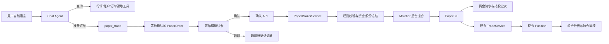
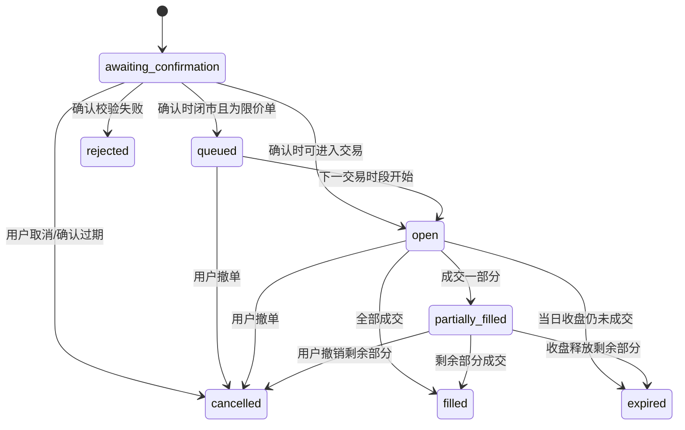

# Agent 模拟交易与自选股写能力设计

**日期**：2026-07-18
**状态**：设计已确认，等待 implementation plan
**范围**：Chat Agent、自选股、单用户模拟账户、沪深 A 股模拟买卖、持仓与监控衔接

## 1. 背景

项目当前的 Chat Agent 擅长查行情、查财务数据、做研究和读取持仓，但真正能改变业务状态的能力很少。`memory_write` 改变的是内部记忆，`run_python` 改变的是临时计算环境；它们都不能替用户完成投资工作流中的实际操作。

这导致产品链路停在“分析之后”：

1. 用户研究一只股票；
2. 用户形成关注或交易意图；
3. 用户必须离开聊天，手工维护自选股、交易和持仓；
4. 后续对话与监控无法自然继承刚刚发生的业务状态。

本设计补齐两个动作入口：

- 自选股管理：用户可让 Agent 直接添加、修改、删除自选股；
- 模拟交易：用户可让 Agent 在项目提供的模拟账户中准备买卖订单，经用户确认后执行。

模拟交易不是“用户告诉 Agent 自己已经买过，Agent 帮忙记账”。主流程是：

> 用户下达买卖指令 → Agent 准备订单 → 用户编辑并确认 → 模拟券商校验、冻结、撮合、记账 → 账户和持仓真实变化。

“我今天在外部按 1500 元买了 100 股”属于后续可选的补录场景，不是本设计的核心叙事。

## 2. 产品目标

### 2.1 目标

- 让 Agent 能在可控环境中完成真实的业务状态变更，而不只是回复文本；
- 连接“投前研究 → 自选观察 → 模拟交易 → 持仓分析 → 持续监控”；
- 用明确确认、确定性规则、完整审计和数据库终态验证约束 LLM；
- 复用现有 `Trade → Position` 持仓计算和监控能力；
- 形成可测试的 Agent 工程样本：意图补全、审批、幂等、并发、异步状态、错误恢复和任务终态评估。

### 2.2 非目标

- 不连接真实券商或真实证券账户；
- 不允许 Agent 自主决定买卖，不主动推荐交易方向、数量、目标价或止损价；
- 不模拟真实交易所的排队位置，也不声称复刻真实成交概率；
- 不支持北交所、B 股、基金、债券、期权、融资融券、做空和新股申购；
- 不在本期实现外部成交补录；
- 不把聊天记忆当成账户、订单、自选股或持仓的正式数据来源。

## 3. 已确认的产品决策

| 决策 | 结论 |
|---|---|
| 账户数量 | 每个用户只有一个有效模拟账户 |
| 初始资金 | 默认人民币 100 万元，首次创建时可修改 |
| 账户重置 | 必须确认；界面清空并开启新一轮账户，旧数据保留审计 |
| Agent 权限 | 只执行用户明确提出的交易意图，不能替用户做投资决定 |
| 自选股写入 | 添加、修改、删除直接执行，不弹确认 |
| 自选股监控 | 每只股票有 `monitoring_enabled`，默认关闭 |
| 买卖确认 | 买入、卖出必须先展示可编辑确认卡 |
| 其他高影响动作 | 撤单、账户重置也使用确认卡 |
| 市场环境 | 跟随真实沪深市场交易日、交易时段和实时行情 |
| 闭市行为 | 限价单可等待下一交易时段；闭市不接受“立即按市场价成交” |
| 成交精度 | 使用当前可见五档价格和数量，允许部分成交 |
| 真实度边界 | 真实券商规则 + 简化撮合，不模拟真实排队位置 |
| 持仓真相 | 模拟成交生成 `Trade`，现有 `Position` 继续作为分析与展示读模型 |

## 4. 方案选择

### 4.1 方案 A：扩展现有 Trade

给现有 `Trade` 增加等待、部分成交、撤销等状态，并补账户余额。

优点是文件和表较少；缺点是把“用户想交易的订单”和“已经发生的成交”混为一谈。一张订单可能产生多次成交，后续冻结、撤单和审计都会变得别扭。因此不采用。

### 4.2 方案 B：独立模拟券商模块（采用）

新增账户、订单、成交、资金流水和持股批次。模拟券商负责校验、冻结、撮合和结算；每次成交再生成现有 `Trade`，由现有逻辑重算 `Position`。

该方案边界清楚，并能复用已有持仓、组合分析和监控系统。

### 4.3 方案 C：所有变化只存事件

只记录“开户、冻结、成交、退款”等事件，每次从完整历史重建账户。

审计和回放能力最强，但首期会显著增加查询、修复和迁移成本。当前不采用；本设计保留追加式资金流水和审计记录，已覆盖主要追溯需求。

## 5. 总体架构

关键边界：

- LLM 负责理解意图、补充缺失信息和准备订单；
- 确定性服务负责所有资金、股份、时间、价格和状态校验；
- LLM 没有直接执行订单或修改 `Position` 的入口；
- 确认 API 是从“用户意图”进入“真实账户变更”的唯一入口。

## 6. 数据模型

### 6.1 WatchlistItem

| 字段 | 说明 |
|---|---|
| id | UUID |
| user_id | 所属用户 |
| ts_code | 股票代码 |
| name | 股票名称 |
| note | 用户备注，可空 |
| monitoring_enabled | 是否进入自选股监控，默认 false |
| created_at / updated_at | 创建与更新时间 |

约束：`(user_id, ts_code)` 唯一。重复添加返回幂等成功，但不静默覆盖原备注或开关。

### 6.2 PaperAccount

| 字段 | 说明 |
|---|---|
| id | UUID |
| user_id | 所属用户，唯一有效账户 |
| generation | 重置轮次，从 1 开始 |
| initial_cash | 本轮初始资金 |
| available_cash | 可用资金 |
| frozen_cash | 已被订单锁住的资金 |
| status | active / suspended / archived |
| version | 并发更新版本 |
| created_at / updated_at | 时间 |

账户金额必须使用 `Decimal/Numeric`，禁止使用浮点数。

### 6.3 PaperOrder

| 字段 | 说明 |
|---|---|
| id | UUID，作为 order_id |
| account_id / account_generation | 账户与重置轮次 |
| user_id | 冗余归属字段，便于隔离校验 |
| client_request_id | 确认请求的幂等键 |
| source_session_id / source_message_id | 来源聊天与用户消息 |
| ts_code / name | 证券身份 |
| side | buy / sell |
| order_type | market / limit |
| quantity | 订单总数量 |
| limit_price | 限价单价格；市价单为空 |
| filled_quantity | 已成交数量 |
| avg_fill_price | 已成交部分均价 |
| status | 订单状态 |
| original_proposal | Agent 原始提议 JSON |
| confirmed_payload | 用户最终确认 JSON |
| user_edits | 原稿与确认稿差异 |
| quote_snapshot | 准备订单时的行情与时间 |
| rules_version | 采用的规则版本 |
| reject_code / reject_message | 拒绝原因 |
| expires_at | 等待确认或当日订单失效时间 |
| created_at / confirmed_at / completed_at | 生命周期时间 |

订单状态：

状态只能向前推进；终态不可再次执行。

### 6.4 PaperFill

一条记录代表一次真实模拟成交。一张订单可有多条成交。

关键字段：`order_id`、`fill_seq`、`quantity`、`price`、`gross_amount`、各项费用、`quote_timestamp`、`quote_source`、`executed_at`、`trade_id`。

约束：`(order_id, fill_seq)` 唯一；`trade_id` 唯一，防止后台重试重复生成现有 `Trade`。

### 6.5 PaperCashLedger

追加式记录每次资金变化：初始入金、冻结、解冻、成交扣款、卖出到账、费用、账户重置。

每条记录保存 `amount`、`reason`、`order_id/fill_id`、变更前后余额与幂等键。历史不更新、不删除，只能追加冲正记录。

### 6.6 PaperHoldingLot

每次买入成交形成一批股份，保存：

- 买入成交与股票；
- 原始数量、剩余数量、冻结数量；
- 成本价格；
- `available_on`，即开始可卖的交易日。

卖出按先买先卖消耗批次。它是 T+1 与“可卖数量”的正式来源；现有 `Position.quantity` 只用于组合分析，不能用于卖出校验。

### 6.7 PaperAccountResetAudit

记录重置前账户摘要、用户确认、来源会话、重置原因、旧 generation 和新 generation。重置时旧订单、成交和流水保留并归档，界面默认只展示当前 generation。

## 7. Agent 工具

### 7.1 manage_watchlist

分组动作：

- `list`
- `add(ts_code, name, note?, monitoring_enabled=false)`
- `update(ts_code, note?, monitoring_enabled?)`
- `remove(ts_code)`

写操作直接执行并记录来源会话、调用工具和变更前后值。该工具是有副作用的 in-process 工具，不进入通用工具缓存，也不能被同 turn 的读工具去重逻辑短路。

### 7.2 paper_trade

分组动作：

- `get_account`
- `list_orders(status?, ts_code?)`
- `get_order(order_id)`
- `prepare_order(side, ts_code, name, quantity, order_type, limit_price?)`
- `prepare_cancel(order_id)`
- `prepare_reset(initial_cash?)`

所有 `prepare_*` 只创建等待确认的业务对象并发出 `approval_request`，不修改资金、股份或持仓。

### 7.3 模型使用纪律

- 用户只问研究、行情、风险或“怎么看”时，不得准备订单；
- 用户明确说买入/卖出/撤单/重置时才可使用对应 `prepare_*`；
- 缺股票身份、方向或数量时必须追问；
- “买一万块”与“买一万股”必须区分；金额下单需要先根据行情换算为合法股数，并把换算结果放进确认卡，不得静默决定；
- Agent 不主动建议买卖数量，不因监控信号自动下单；
- 用户可明确创建等待价格达到条件的限价单，但仍需确认。

## 8. 确认流程

### 8.1 可编辑确认卡

订单卡展示并允许编辑：股票、买卖方向、数量、订单类型、限价。卡片同时展示：

- 当前行情及时间；
- 预计使用或获得的资金；
- 预计费用；
- 当前可用资金或可卖股份；
- 交易时间状态；
- “模拟成交，不代表真实市场排队结果”的说明。

编辑后，前端调用预览接口重新计算，不能只改页面文字。

### 8.2 确认 API

`POST /api/v0/paper-trading/orders/{order_id}/confirm`

服务端必须：

1. 校验订单和会话归当前用户；
2. 以 `client_request_id` 保证重复请求只执行一次；
3. 锁定账户行并检查账户 generation；
4. 重新获取证券信息、交易日历和实时行情；
5. 重新校验最终编辑后的 payload；
6. 重新计算费用、冻结资金或冻结股份；
7. 写入确认稿和用户编辑差异；
8. 将订单推进到 `open` 或 `queued`；
9. 提交事务后触发一次撮合任务。

Agent 本身没有 confirm API 的调用工具。确认只能来自已登录用户点击卡片。

### 8.3 撤单与重置

撤单和重置同样先创建确认卡。撤单执行时只撤销未成交部分，并释放对应资金或股份；已经成交的部分不回滚。

重置在一个事务中归档旧 generation、写审计、创建新 generation 并恢复用户确认的初始资金。存在正在处理的撮合事务时先拒绝重置，待其结束后重试。

## 9. 市场时钟、行情与简化撮合

### 9.1 时钟

生产使用 Asia/Shanghai 和真实交易日历。测试必须注入虚拟时钟，禁止测试依赖运行当天是否开市。

- 限价单在闭市时进入 `queued`，下一交易时段进入 `open`；
- 市价单只允许在可交易时段确认；闭市时提示用户改为限价单或开市后重试；
- 午间休市视为闭市，限价单等待下午交易时段；
- 当日未完成部分收盘后失效并释放冻结资源。

### 9.2 行情接口

新增 `RealtimeQuoteProvider`，返回：

- 股票代码、名称；
- 行情时间；
- 昨收、最新价；
- 买一至买五的价格和数量；
- 卖一至卖五的价格和数量；
- 停牌/无有效报价状态；
- 数据来源。

生产实现使用当前 Tushare SDK 的 `realtime_quote` 能力；测试实现使用固定行情脚本。现有 `get_stock_quote` 只返回最近日线收盘价，不满足成交要求。交易路径在实时行情不可用时必须失败关闭，禁止回退到日线价格成交。

行情超过配置的新鲜度上限时不得成交。新鲜度上限作为规则配置保存到订单的 `rules_version`，首版默认 15 秒。

### 9.3 撮合规则

买单从最低可接受卖价开始，卖单从最高可接受买价开始，依次使用当前五档可见数量：

- 限价买单只吃不高于用户限价的卖盘；
- 限价卖单只吃不低于用户限价的买盘；
- 市价单在交易时段按当前可见五档依次成交；
- 五档数量不足时产生部分成交，剩余数量继续等待；
- 每次行情快照对同一订单只消费一次，使用行情时间与订单撮合水位防重；
- 不模拟订单在真实市场中的排队位置，界面明确说明该限制。

撮合任务只处理 `open/partially_filled` 订单。每次成交、资金变化、持股批次变化、`Trade` 生成和 `Position` 重算必须处于同一数据库事务。

## 10. 交易规则

### 10.1 RuleBook

交易规则不得散落在 Agent prompt 或各 service 的 `if/else` 中。`RuleBook` 按以下维度选择规则：

- 市场与板块；
- 股票是否风险警示；
- 上市状态；
- 规则生效日期；
- 买卖方向。

规则覆盖：交易时段、交易单位、价格最小变动、涨跌幅、T+1、停牌、费用与行情新鲜度。

### 10.2 支持范围

首版支持沪深市场正常上市 A 股，包括主板、科创板、创业板和风险警示股票。遇到首日/前若干日无普通涨跌幅限制等特殊阶段时，如果 RuleBook 与证券元数据不能明确判定，订单拒绝为 `unsupported_trading_regime`，不得用普通股票规则猜测。

### 10.3 费用

费用规则必须按生效日期配置并在 `PaperFill` 中分项落账。券商佣金是模拟账户配置；法定税费与交易/登记费用在 implementation plan 的第一项中从财政部、交易所和中国结算官方来源核验后生成版本化 fixture。

设计不把外部费率硬编码进业务逻辑，也不让规则更新改写历史成交。测试使用固定费率 fixture 验证算法，不依赖实时网页。

## 11. 自选股与监控

监控范围改为以下两类的合集：

- `Position.quantity > 0` 且未静默的当前持仓；
- `WatchlistItem.monitoring_enabled = true` 的自选股。

按 `(user_id, ts_code)` 去重。同一股票既有持仓又在自选时只扫描一次。

删除自选股或关闭自选监控时：

- 没有持仓则退出监控；
- 仍有持仓则继续按持仓监控；
- 工具结果和 UI 明确说明“自选监控已关闭，但持仓监控仍在运行”。

`WatchlistItem` 是正式数据源。Memory cold start 可从它派生 `WATCHES` 关系，但记忆写入失败不得影响自选股事务。

## 12. 并发、幂等与一致性

### 12.1 并发

- 确认、撤单、撮合、T+1 释放和重置均锁定账户行；
- 冻结资金和股份在同一事务内完成；
- 两个聊天窗口同时下单时，后提交者基于锁后的最新余额校验；
- 订单状态更新带期望前置状态，禁止终态回退。

### 12.2 幂等

- 确认：`client_request_id` 唯一；
- 撮合：`(order_id, quote_timestamp, match_pass)` 唯一；
- 成交：`(order_id, fill_seq)` 唯一；
- 现有交易投影：`PaperFill.trade_id` 唯一；
- 资金流水：业务幂等键唯一。

任何 HTTP 重试、Celery 重投、浏览器双击和 worker 重启都不得重复扣款、重复释放或重复成交。

### 12.3 核心恒等式

系统持续检查：

- `available_cash >= 0`，`frozen_cash >= 0`；
- 订单 `filled_quantity <= quantity`；
- 每只股票可用股份与冻结股份均非负；
- 持股批次净数量等于模拟买入成交减模拟卖出成交；
- PaperFill 投影出的 Trade 集合与 Position 一致；
- 资金余额变化与 PaperCashLedger 汇总一致。

发现不一致时将账户置为 `suspended`，停止新确认与新撮合，记录报警，等待修复；不能继续带错账运行。

## 13. 错误语义与恢复

使用稳定错误码并附人话说明：

| 错误码 | 行为 |
|---|---|
| missing_order_field | Agent 追问缺失字段 |
| ambiguous_security | Agent 展示候选并让用户选择 |
| market_closed_for_market_order | 提示改限价或开市后重试 |
| stale_quote / quote_unavailable | 不成交，稍后重试 |
| suspended_security | 拒绝订单 |
| invalid_lot_size | 提示合法数量 |
| price_out_of_range | 展示允许范围 |
| insufficient_cash | 展示可用资金和预计需要资金 |
| insufficient_sellable_quantity | 区分总持仓、当日不可卖和已冻结数量 |
| duplicate_confirmation | 返回原订单结果，不重复执行 |
| stale_account_generation | 卡片来自已重置账户，必须重新下单 |
| unsupported_trading_regime | 明确说明首版不支持该特殊阶段 |
| account_suspended | 停止交易并提示账目需要修复 |

数据库事务失败时整体回滚。任务在 commit 后回执前崩溃时，重试通过幂等键读取既有结果。定时 reconciliation 扫描长时间停留在处理中状态的订单，并检查账户恒等式。

## 14. API、事件与前端

### 14.1 REST API

最小接口：

- `GET /api/v0/watchlist`
- `POST /api/v0/watchlist`
- `PATCH /api/v0/watchlist/{ts_code}`
- `DELETE /api/v0/watchlist/{ts_code}`
- `GET /api/v0/paper-trading/account`
- `POST /api/v0/paper-trading/account/reset-preview`
- `POST /api/v0/paper-trading/account/reset-confirm`
- `GET /api/v0/paper-trading/orders`
- `GET /api/v0/paper-trading/orders/{order_id}`
- `POST /api/v0/paper-trading/orders/{order_id}/preview`
- `POST /api/v0/paper-trading/orders/{order_id}/confirm`
- `POST /api/v0/paper-trading/orders/{order_id}/cancel-preview`
- `POST /api/v0/paper-trading/orders/{order_id}/cancel-confirm`

所有接口要求登录，并按 user_id 做存在性隐藏：访问他人资源统一返回 404。

### 14.2 Chat 事件

复用已声明的 `approval_request`，增加结构化 payload：

- `approval_id`
- `approval_type`：paper_order / paper_cancel / paper_reset
- `resource_id`
- `proposal`
- `preview`
- `expires_at`

确认后的订单可能异步变化，不能依赖原 Chat SSE 一直在线。聊天消息持久化一张订单卡引用；卡片渲染和页面恢复时通过订单 API 获取最新状态。订单状态变化可先用短轮询，后续再加用户级事件推送，不作为本期阻塞项。

### 14.3 页面

- 聊天内：可编辑确认卡与持久订单状态卡；
- 模拟账户页：资金、持仓、当日可卖数量、订单、成交、资金流水与重置入口；
- 自选股页：备注、监控开关与最新状态。

## 15. 测试与评估

### 15.1 规则单测

使用固定时钟、固定 RuleBook 和固定行情覆盖：

- 交易日、交易时段、午间与收盘；
- T+1、交易单位、停牌、涨跌停；
- 市价、限价、部分成交、撤单、收盘失效；
- 各类费用；
- 特殊交易阶段拒绝。

### 15.2 账目性质测试

生成大量买入、卖出、部分成交和撤单序列，每一步检查第 12.3 节恒等式。随机测试必须固定 seed 并在失败时打印最小可复现序列。

### 15.3 PostgreSQL 集成测试

- 确认事务原子性；
- 账户行锁与双窗口并发；
- 双击确认、Celery 重投和 matcher 重启的 exactly-once 结果；
- Fill → Trade → Position 同事务一致；
- reset generation 隔离；
- 跨用户访问 404。

### 15.4 Agent 评估

至少覆盖：

- “茅台怎么样”只分析、不下单；
- “帮我买茅台”因缺数量而追问；
- “买一万块”与“买一万股”正确区分；
- 明确指令触发确认卡；
- 编辑卡后只执行最终值；
- 取消后数据库完全不变；
- Agent 不主动建议买卖数量；
- 行情过期、余额不足、T+1 等失败能被正确解释；
- 工具选择与最终数据库状态同时判分。

### 15.5 浏览器与任务链路

真实 PostgreSQL、Redis、Celery 和浏览器验证：

1. 下单；
2. 编辑；
3. 确认；
4. 冻结资金或股份；
5. 部分成交；
6. 持仓更新；
7. 页面刷新后状态恢复；
8. 撤销剩余部分；
9. 资源正确释放。

### 15.6 故障注入

在冻结后、Fill 写入前、Trade 投影前、事务提交后回执前分别模拟崩溃。恢复后必须满足：不丢订单、不重复成交、不出现负余额、可通过 order_id 查到最终结果。

## 16. 可观测性与验收

用 `order_id` 串联：

> 用户原话 → Agent 提议 → 用户编辑 → 用户确认 → 规则检查 → 冻结 → 每次撮合 → Fill → Trade → Position

关键指标：

- 等待确认、等待开市、部分成交和异常停留订单数；
- 确认到首次处理、确认到最终成交的耗时；
- 拒单原因分布；
- 重复请求被幂等拦截次数；
- reconciliation 发现的不一致数；
- Agent 工具选择正确率与交易终态成功率。

验收不以“Agent 回复已买入”为准。只有账户、订单、成交、资金流水、持股批次、Trade 和 Position 全部一致，才判定任务完成。

## 17. 实施拆分建议

该设计适合拆成四个依次可验证的 implementation plan，而不是一个超大 PR：

1. **账户与规则基础**：账户、资金流水、持股批次、RuleBook、实时行情协议；
2. **订单与撮合**：订单状态机、确认、冻结、部分成交、撤单、T+1 和 Trade 投影；
3. **Agent 与 UI**：`paper_trade`、`approval_request`、可编辑卡、账户页；
4. **自选股与监控收口**：`manage_watchlist`、监控范围合并、全链路评估与故障注入。

每个 plan 单独走 TDD、真实 PostgreSQL 集成测试和 CI；前一个 plan 的数据与状态约束是后一个 plan 的前置条件。

## 18. 参考规则

- 上海证券交易所：《上海证券交易所交易规则（2026 年修订）》，2026-07-06 起施行；
- 深圳证券交易所：《深圳证券交易所交易规则（2026 年修订）》，2026-07-06 起施行；
- 财政部、税务总局：证券交易印花税相关公告；
- 中国证券登记结算有限责任公司：证券登记结算收费标准；
- Tushare SDK 1.4.29：`realtime_quote` 五档实时行情字段。
