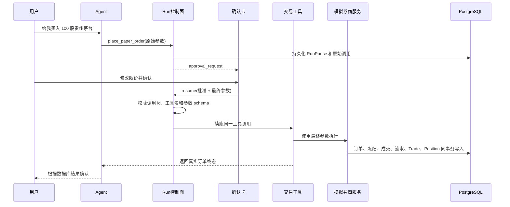

# 模拟交易与自选股适配统一 Agent 运行时设计

**日期**：2026-07-23  
**状态**：已确认迁移方向  
**基线**：`origin/main@9c89b9e0`

## 1. 为什么要做这次适配

旧分支已经实现模拟账户、订单撮合、自选股、确认卡和相关测试，但它基于已经退役的 Chat Router、Celery `chat_runner` 和 `useChatSSE`。最新主线改成了统一安全工具运行时和 Run/Attempt 控制面：

```text
React Chat
  -> Run API
  -> Run / Attempt / RunPause
  -> ChatRunExecutor
  -> ToolLoop
  -> DurableToolHub
  -> ToolRuntime
  -> 领域服务
```

因此不能把旧分支的 106 个提交直接合并，也不能只解决文件冲突。目标是保留业务能力，按新架构重新接入。

## 2. 不变的产品规则

- 每个用户只有一个当前有效模拟账户。
- 模拟账户不连接真实券商。
- 用户明确说买入、卖出、撤单或重置后，Agent 才能发起动作。
- 模拟买卖、撤单、重置必须先确认；确认卡允许用户编辑。
- 后端只执行用户最终确认的内容，并保留 Agent 原稿、用户改稿和两者差异。
- 自选股新增、修改、删除直接执行，不弹确认。
- 每只自选股有 `monitoring_enabled`，默认关闭，用户可编辑。
- `Trade` 是成交事实来源；`Position` 由成交重算，Agent 不直接改 `Position`。
- 模拟账户、订单、自选股和持仓以数据库为准，不以聊天文本或 Memory 为准。

## 3. 比较过的迁移方式

| 方式 | 优点 | 问题 | 结论 |
|---|---|---|---|
| 在旧分支逐个解冲突 | 表面上保留全部提交 | 会把已删除的旧 Chat 执行链重新带回主线，后续维护两套机制 | 不采用 |
| 从主线批量 cherry-pick 旧提交 | 比逐文件合并快 | 提交同时混有领域代码和旧接入代码，仍会产生结构冲突 | 只把旧提交当参考，不直接批量搬运 |
| 从最新主线重新接入业务能力 | 历史最干净，能完整使用新权限、暂停、续跑和执行账本 | 需要重写 Agent 与前端接入层 | 采用 |

## 4. 总体结构

迁移分成三层：

1. **领域层**：选择性迁移旧分支中与 Chat 无关的账户、订单、撮合、费用、规则、自选股和监控代码。
2. **Agent 运行时层**：把写操作注册到统一 `ToolHub`，使用静态风险等级、RunPause、持久化工具执行账本和崩溃恢复。
3. **前端层**：把旧确认卡改接 `useRunSSE` 的 pause/resume，不恢复已删除的 `useChatSSE`。

旧 Chat Router、`chat_runner.py`、`chat_session_repo.py`、旧 SSE store 和旧消息恢复逻辑都不迁移。

## 5. 工具边界

统一运行时的风险定义以“工具”为单位，不以同一工具里的 `action` 动态降级。为了避免读操作被误要求确认，也避免由模型参数决定风险等级，模拟交易按风险拆成静态能力：

| 工具 | 风险 | 行为 |
|---|---|---|
| `get_paper_account` | 低 | 查询当前模拟账户 |
| `list_paper_orders` | 低 | 查询模拟订单 |
| `get_paper_order` | 低 | 查询单个模拟订单 |
| `place_paper_order` | 高 | 买入或卖出，必须暂停确认 |
| `cancel_paper_order` | 高 | 撤销未成交部分，必须暂停确认 |
| `reset_paper_account` | 高 | 开启新账户轮次，必须暂停确认 |
| `manage_watchlist` | 低、可重试 | list/add/update/remove；写入直接执行 |

这些工具在渐进披露文档里仍归为“模拟交易”和“自选股”两个产品能力，不把底层风险拆分暴露成复杂的用户概念。

### 5.1 自选股为什么可以直接写

`manage_watchlist` 是低影响、可纠正的状态变更。运行时允许它直接执行，但仍经过：

- 用户和租户可见性校验；
- Pydantic 输入校验；
- PostgreSQL 事务；
- `RunToolExecution` 持久化账本；
- `WatchlistAudit` 业务审计。

工具必须具备重试幂等性：重复 add 返回已有记录；相同 update 不重复写审计；重复 remove 返回已删除结果，不制造错误终态。

### 5.2 模拟交易为什么不能使用“准备后走独立确认 API”

新运行时已经提供统一的高风险工具暂停和续跑。如果继续沿用旧的“工具先建待确认订单，再由独立 HTTP API 确认”，系统会出现两套审批事实源：

- `RunPause` 认为工具尚未执行；
- `PaperOrder.awaiting_confirmation` 认为工具已经执行过一半。

新设计只保留 `RunPause` 作为确认事实源。高风险工具在批准前完全不执行；批准后由同一个工具调用完成确定性校验和业务事务。

## 6. 可编辑审批

现有 Run 审批只接受批准或拒绝。为支持交易卡编辑，扩展审批响应：

```json
{
  "approved": true,
  "edited_arguments": {
    "tool-call-id": {
      "side": "buy",
      "ts_code": "600519.SH",
      "name": "贵州茅台",
      "quantity": 100,
      "order_type": "limit",
      "limit_price": "1500.00"
    }
  }
}
```

约束：

- `edited_arguments` 只允许引用本次 pause 中的工具调用 id；
- 只能改参数，不能改工具名、用户、租户、Run、会话或调用 id；
- 只有声明支持编辑的交易工具可以携带编辑值；
- 拒绝时不接受编辑值；
- RunService 在解除 pause 前，用目标工具 schema 校验编辑后的完整参数；
- continuation 中保存 Agent 原始参数，RunPause 响应保存用户最终参数；
- 执行账本记录最终有效参数；
- 领域订单保存原稿、确认稿和字段级差异，并关联 `run_id`、`tool_call_id`。

续跑时，`ChatRunExecutor` 用编辑后的参数构造待执行调用；`DurableToolHub` 仍以原工具调用 id 做一次性执行和恢复保护。

## 7. 模拟交易执行链



买卖工具不接受由模型填写的用户 id、账户 id或审批 id。这些值来自可信运行上下文。

业务幂等键由服务端根据 `run_id + tool_call_id` 生成。浏览器重复提交、Worker 重投或回复丢失都返回同一业务结果，不重复扣款或成交。

## 8. 领域层迁移

以下旧实现可以选择性迁移并按最新模型基类、应用启动和 Celery 注册方式调整：

- `PaperAccount`、`PaperOrder` 及订单状态；
- 账户、订单、撮合、结算、费用、行情、规则和 reconciliation 服务；
- 自选股模型、服务和 append-only 审计；
- 自选股与持仓监控范围合并；
- REST 查询、预览和页面所需接口；
- 规则 fixture、评估样例和领域测试。

以下旧实现不迁移：

- 对旧 `chat_runner.py` 的事件探测；
- 对旧 `chats.py` 的审批消息持久化；
- `useChatSSE`、旧 `current-chat` 审批恢复和旧 ChatSession API；
- 任何重新引入已删除模块的兼容层。

## 9. 前端适配

确认卡直接渲染当前 Run 的 `approval_request`：

- 普通高风险工具继续使用通用 JSON 审批卡；
- `place_paper_order`、`cancel_paper_order`、`reset_paper_account` 使用交易专用卡；
- 买卖卡允许编辑方向、股票、数量、订单类型和限价；
- 编辑后调用无副作用 preview API 重新计算行情、费用、资金和可卖数量；
- preview 成功且内容未再次修改后才能批准；
- 批准调用 Run resume，并携带最终参数；
- 页面刷新后从 RunSession 的 active pause 恢复同一张卡；
- Run 恢复后，卡片根据订单查询接口轮询终态。

模拟账户页和自选股页选择性迁移，但 API 路径、鉴权和路由注册以最新主线为准。

## 10. 安全、错误和恢复

- 未知写工具继续 fail closed。
- 模拟交易工具不进入安全自动重试目录。
- 自选股工具进入版本化安全重试目录，但领域操作必须幂等。
- 交易工具在数据库提交后、执行账本完成前崩溃时，运行时进入已有的 unsafe recovery 审批；业务幂等键保证再次执行不重复成交。
- 过期行情、闭市市价单、资金不足、可卖数量不足、T+1、停牌和不支持规则均由确定性服务返回稳定错误码。
- 工具输出在进入运行时边界前转为 JSON-safe 数据。
- 跨用户资源一律按不存在处理。

## 11. 测试与验收

按 TDD 分层验证：

1. **运行时单测**：编辑参数的批准、拒绝、越权 call id、工具名不可变、schema 失败、刷新恢复。
2. **工具单测**：静态风险分类、自选股直接执行、交易先暂停后执行、可信上下文注入。
3. **PostgreSQL 集成测试**：账户唯一、幂等、并发余额、成交到 Trade/Position、跨用户 404。
4. **Worker 测试**：批准续跑、重复 resume、提交后崩溃、unsafe recovery。
5. **前端 Vitest**：交易卡编辑、preview、批准/拒绝、恢复和错误状态。
6. **Playwright**：聊天发起买卖、编辑确认、账户变化；自选股直接增改删和监控开关。
7. **Agent eval**：工具选择和数据库终态同时评分。

验收以数据库终态和 Run/工具账本一致为准，不以 Agent 文本声称“已买入”作为完成依据。

## 12. 交付边界

本次迁移完成后：

- 新分支只基于最新主线；
- 不存在对旧 Chat 执行链的依赖；
- 旧 PR 保留为实现参考，新建适配 PR；
- 后端、前端和浏览器测试均在新分支实际运行；
- 用户原有工作区和 `uv.lock` 改动保持不动。
